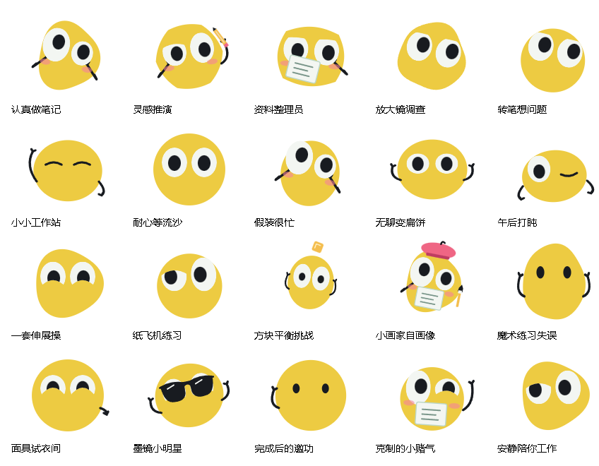
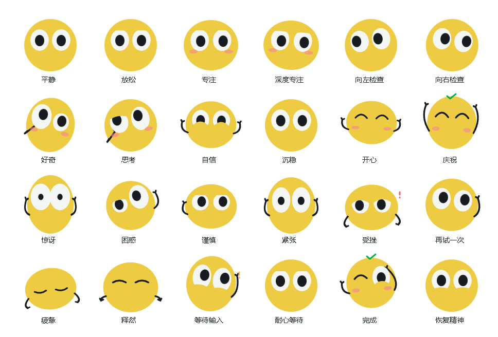
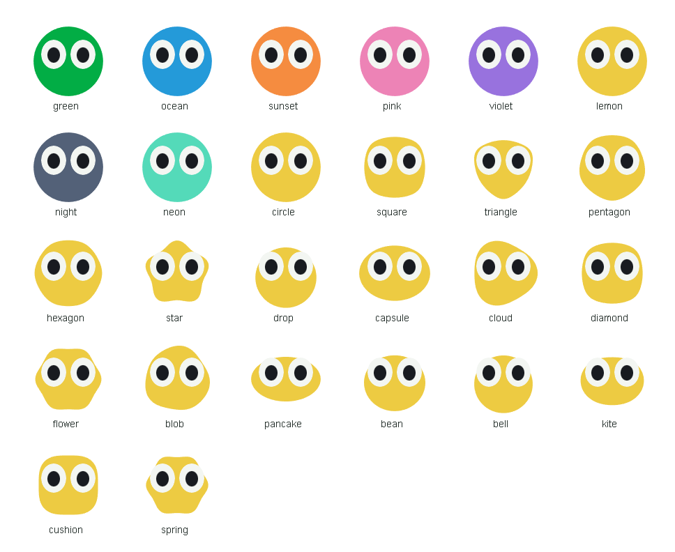

<div align="center">

# Codex Bot

一个会看 Codex 任务、递提醒、陪伴工作的轻量桌面机器人。

[](LICENSE)
[](https://github.com/WuXinbo-bo/Codex-Bot/releases/latest)
[](https://github.com/WuXinbo-bo/Codex-Bot/actions/workflows/ci.yml)

[下载安装](https://github.com/WuXinbo-bo/Codex-Bot/releases/latest) · [功能](#功能) · [表情与动作](#表情与动作) · [开发与预览](#开发与预览) · [许可](#许可)

</div>



## 功能

- **任务感知**：读取本机 Codex 状态与增量日志，显示进行中、排队、等待处理的任务；断线时明确标记缓存或待核实，不把未知状态当作成功。
- **轻量提醒**：开始任务、完成任务与需要处理使用独立通知。完成条默认保留，查看任务不会清除，确认后才清除。
- **可交互桌面伙伴**：注视、点击、长按、拖拽、碰边、任务板交互；白色紧凑面板随机器人移动。
- **丰富但不抢戏**：149 个表情与姿态、211 套活动（含 20 套约 15 秒连续动作和 23 套独立任务表演）、18 套眼部方案、18 种形状、24 件道具、24 种整脸面具。
- **有记忆的小故事**：5 条故事线、9 段新编动作，排练后递交、藏起再拿出道具、完成后等待回应。
- **风格与收藏**：新增默剧、黏土、折纸、涂鸦、像素、橡皮管 6 种整体风格；安静、细心、活泼 3 种节奏，遇见过的表演可以收藏、减少出现或空闲回放。
- **按场景调度**：工作与空闲使用不同动作池，优先轮换、减少重复；鼠标靠近不打断长动作，点击后可接续，任务通知与拖拽优先。
- **自定义**：8 套皮肤，默认柠檬黄；面具、随机动作、动画强度和完成提醒均可设置。
- **原生轻量**：Tauri 2 + 系统 WebView2，不把 Electron 或 Node.js 打进正式安装包。

## 表情与动作

不止 20 套长动作。机器人还会专注思考、好奇张望、犹豫检查、疲惫伸展，随着任务和你的操作切换神态。



| 内容 | 当前规模 | 例子 |
| --- | --- | --- |
| 表情与姿态 | 149 个 | 专注、期待、困惑、谨慎、释然、恢复精神 |
| 活动编排 | 211 套 | 做笔记、转笔、画画、折纸飞机、魔术、伸展 |
| 独立任务表演 | 上述活动中的 23 套 | 开始 5 套、进行中 6 套、完成 7 套、异常与待处理 5 套 |
| 眼部方案 | 18 套 | 10 套常驻眼型、8 套情境眼神；经典与动漫保留，其余重绘，统一眨眼、视线与眼皮裁切 |
| 连续小剧场 | 上述活动中的 20 套 | 每套约 15 秒，带准备、表演和收尾，配有细微演出变化 |
| 整脸面具 | 24 种 | 配合 6 种佩戴动作，作为完整面具出场 |
| 道具与配件 | 24 件 | 放大镜、笔记本、铅笔、沙漏、画笔、墨镜 |
| 身体形状 | 18 种 | 方形、三角形、星星、水滴、云朵、扁饼 |
| 皮肤预设 | 8 套 | 默认柠檬黄，也可切换绿、蓝、粉等配色 |



靠近时看向你，点击时回应，拖动时跟随惯性，碰到边缘时做出反应；任务开始递出提醒，完成后保留完成条等待确认。短动作和长剧情共同参与调度，不只是循环播放同一个表情。

以上数量来自源码注册表；活动是表情与道具的组合编排，不等于独立表情素材数量。

## 安装与首次使用

1. 安装并登录 Codex 桌面端，确认可以正常运行任务。
2. 在 [Releases](https://github.com/WuXinbo-bo/Codex-Bot/releases) 下载 Windows x64 安装包并运行。
3. 打开 Codex Bot，按连接向导检测。无法自动识别时，在连接设置选择可信的 Codex 程序和数据目录。
4. 在 Codex 运行一个任务，确认开始提醒、完成提醒、查看任务和确认清除均正常。

需要 Windows 10/11 x64 和 WebView2。缺少 WebView2 时安装器会请求下载，因此首次安装可能需要联网。
更新签名用于验证更新包，不代表已购买 Windows Authenticode 代码签名证书；Windows 可能显示信誉提示。

已有 Meta Bot 用户：保留原有内部应用标识与 `.metabot` 数据目录，避免丢失设置和未确认提醒。旧版没有更新入口时，请先手动安装本版本。

## 开发与预览

需要 Node.js 22、Rust stable、Windows C++ Build Tools 和 WebView2。

```powershell
npm ci
npm test
npm run check:native
npm run dev:native
```

动作展示页：在项目根目录启动静态文件服务器，打开 `test/fixtures/m1-visual.html`。该页面是视觉测试工具，不会代替桌面程序连接 Codex。

```powershell
npx --yes http-server . -p 4187 -c-1
# http://127.0.0.1:4187/test/fixtures/m1-visual.html
```

生产构建需要本项目的更新签名密钥；不要使用其他项目的密钥或提交私钥。开发调试不需要私钥。

## 项目结构

```text
src/             机器人、面板、表情、道具与更新界面
native/          原生窗口协调、Codex 连接与前后端桥接
shared/          任务、通知、布局和更新状态机
src-tauri/       Rust 原生能力、签名更新与安装器配置
test/            单元测试、视觉检查脚本及展示页
release/         公开发布仓库配置与验签公钥
.github/         持续检查和签名 Release 流程
docs/            设计、验收及发布说明
```

## 问题反馈与贡献

通过 [Issues](https://github.com/WuXinbo-bo/Codex-Bot/issues) 提交问题，附 Windows/Codex 版本、复现步骤和脱敏截图。不要上传 token、私钥、完整任务日志或个人目录内容。
提交 PR 前运行 `npm test`、`npm run check:native` 和 `npm run release:check`。

## 许可

本项目自有代码与素材采用 [Apache License 2.0](LICENSE)。第三方依赖保留原许可，见 [NOTICE](NOTICE) 与 [第三方说明](THIRD_PARTY_NOTICES.md)。
