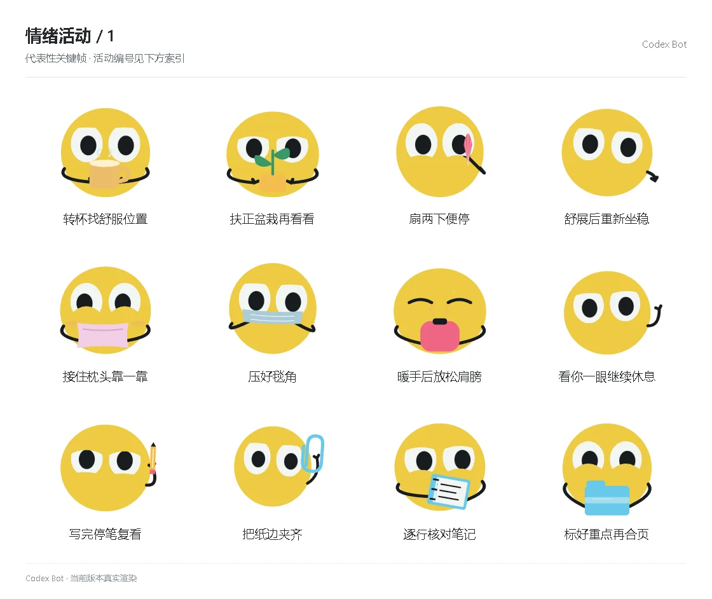

# 情绪活动 / 1

[图鉴目录](README.md) · [项目首页](../../README.md) · [下一页](emotion-02.md)

| 活动 | 编号 | 基准时长 |
| --- | --- | ---: |
| 转杯找舒服位置 | `activity_cup_place` | 8.80 秒 |
| 扶正盆栽再看看 | `activity_plant_straight` | 9.50 秒 |
| 扇两下便停 | `activity_fan_pause` | 10.20 秒 |
| 舒展后重新坐稳 | `activity_stretch_seat` | 8.80 秒 |
| 接住枕头靠一靠 | `activity_pillow_lean` | 8.80 秒 |
| 压好毯角 | `activity_blanket_corner` | 9.50 秒 |
| 暖手后放松肩膀 | `activity_warmer_relax` | 10.20 秒 |
| 看你一眼继续休息 | `activity_rest_watch` | 8.80 秒 |
| 写完停笔复看 | `activity_write_review` | 8.80 秒 |
| 把纸边夹齐 | `activity_clip_edges` | 9.50 秒 |
| 逐行核对笔记 | `activity_notes_lines` | 10.20 秒 |
| 标好重点再合页 | `activity_mark_close` | 8.80 秒 |

[图鉴目录](README.md) · [项目首页](../../README.md) · [下一页](emotion-02.md)
