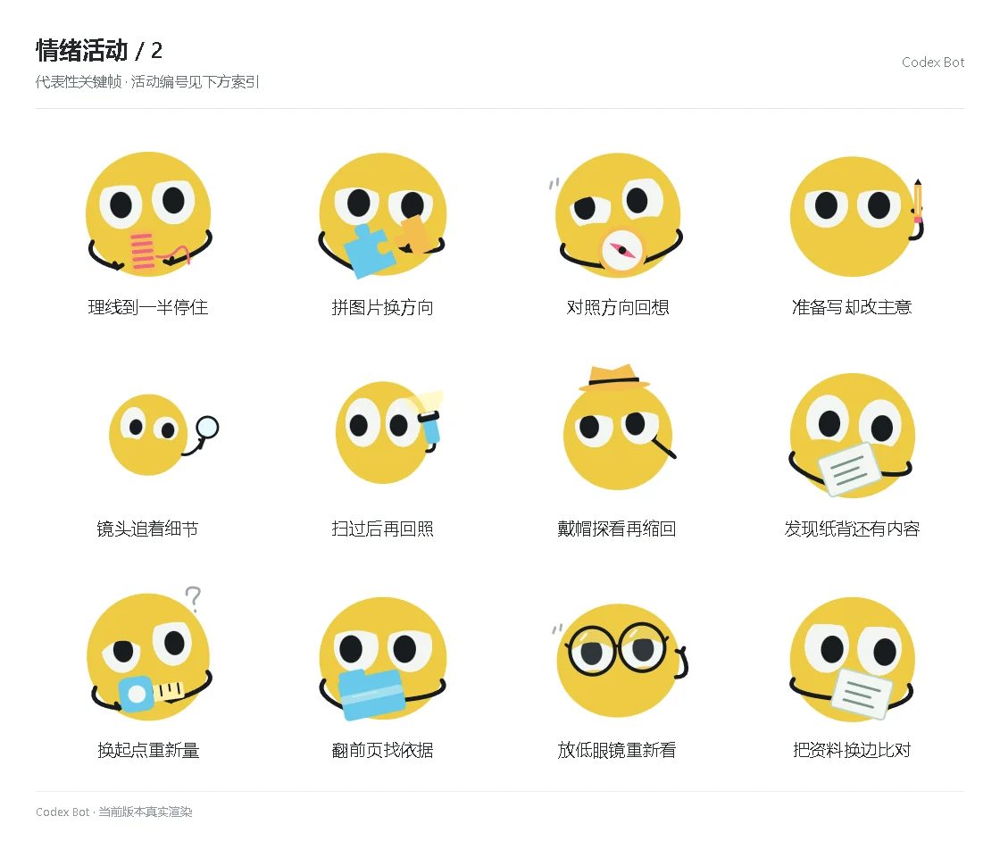

# 情绪活动 / 2

[图鉴目录](README.md) · [项目首页](../../README.md) · [上一页](emotion-01.md) · [下一页](emotion-03.md)

| 活动 | 编号 | 基准时长 |
| --- | --- | ---: |
| 理线到一半停住 | `activity_spool_stop` | 8.80 秒 |
| 拼图片换方向 | `activity_puzzle_rotate` | 9.50 秒 |
| 对照方向回想 | `activity_compass_recall` | 10.20 秒 |
| 准备写却改主意 | `activity_pencil_reconsider` | 8.80 秒 |
| 镜头追着细节 | `activity_lens_trace` | 8.80 秒 |
| 扫过后再回照 | `activity_light_return` | 9.50 秒 |
| 戴帽探看再缩回 | `activity_hat_probe` | 10.20 秒 |
| 发现纸背还有内容 | `activity_card_reverse` | 8.80 秒 |
| 换起点重新量 | `activity_measure_origin` | 8.80 秒 |
| 翻前页找依据 | `activity_folder_evidence` | 9.50 秒 |
| 放低眼镜重新看 | `activity_glasses_recheck` | 10.20 秒 |
| 把资料换边比对 | `activity_card_compare` | 8.80 秒 |

[图鉴目录](README.md) · [项目首页](../../README.md) · [上一页](emotion-01.md) · [下一页](emotion-03.md)
