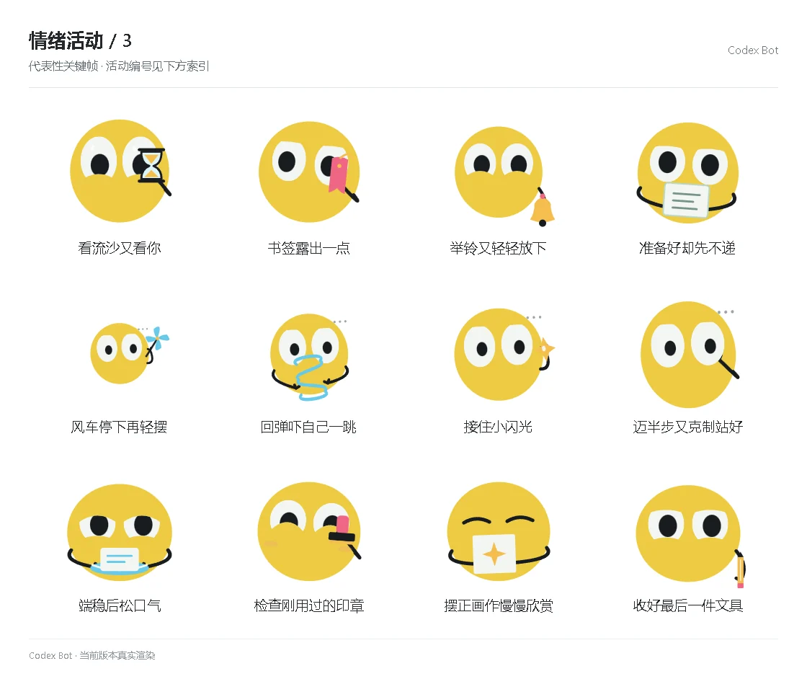

# 情绪活动 / 3

[图鉴目录](README.md) · [项目首页](../../README.md) · [上一页](emotion-02.md) · [下一页](emotion-04.md)

| 活动 | 编号 | 基准时长 |
| --- | --- | ---: |
| 看流沙又看你 | `activity_sand_glance` | 8.80 秒 |
| 书签露出一点 | `activity_bookmark_hint` | 9.50 秒 |
| 举铃又轻轻放下 | `activity_bell_wait` | 10.20 秒 |
| 准备好却先不递 | `activity_card_ready` | 8.80 秒 |
| 风车停下再轻摆 | `activity_wind_again` | 8.80 秒 |
| 回弹吓自己一跳 | `activity_spring_surprise` | 9.50 秒 |
| 接住小闪光 | `activity_spark_catch` | 10.20 秒 |
| 迈半步又克制站好 | `activity_half_step` | 8.80 秒 |
| 端稳后松口气 | `activity_tray_relief` | 8.80 秒 |
| 检查刚用过的印章 | `activity_stamp_inspect` | 9.50 秒 |
| 摆正画作慢慢欣赏 | `activity_drawing_admire` | 10.20 秒 |
| 收好最后一件文具 | `activity_pencil_last` | 8.80 秒 |

[图鉴目录](README.md) · [项目首页](../../README.md) · [上一页](emotion-02.md) · [下一页](emotion-04.md)
