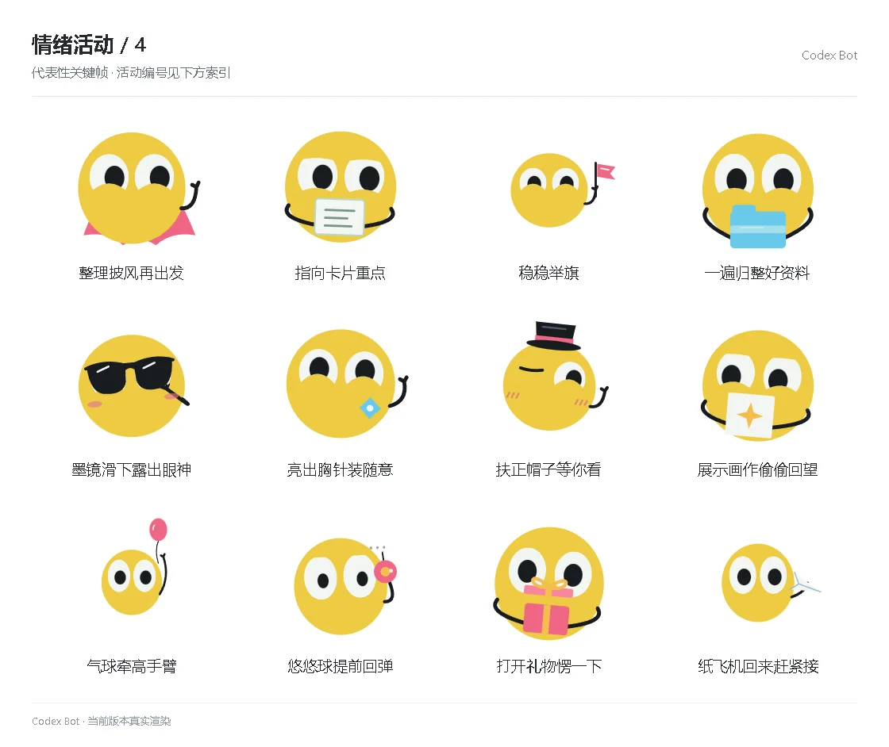

# 情绪活动 / 4

[图鉴目录](README.md) · [项目首页](../../README.md) · [上一页](emotion-03.md) · [下一页](emotion-05.md)

| 活动 | 编号 | 基准时长 |
| --- | --- | ---: |
| 整理披风再出发 | `activity_cape_ready` | 8.80 秒 |
| 指向卡片重点 | `activity_card_point` | 9.50 秒 |
| 稳稳举旗 | `activity_flag_steady` | 10.20 秒 |
| 一遍归整好资料 | `activity_folder_once` | 8.80 秒 |
| 墨镜滑下露出眼神 | `activity_shades_peek` | 8.80 秒 |
| 亮出胸针装随意 | `activity_brooch_casual` | 9.50 秒 |
| 扶正帽子等你看 | `activity_hat_notice` | 10.20 秒 |
| 展示画作偷偷回望 | `activity_drawing_peek` | 8.80 秒 |
| 气球牵高手臂 | `activity_balloon_tug` | 8.80 秒 |
| 悠悠球提前回弹 | `activity_yoyo_early` | 9.50 秒 |
| 打开礼物愣一下 | `activity_gift_pause` | 10.20 秒 |
| 纸飞机回来赶紧接 | `activity_plane_return` | 8.80 秒 |

[图鉴目录](README.md) · [项目首页](../../README.md) · [上一页](emotion-03.md) · [下一页](emotion-05.md)
