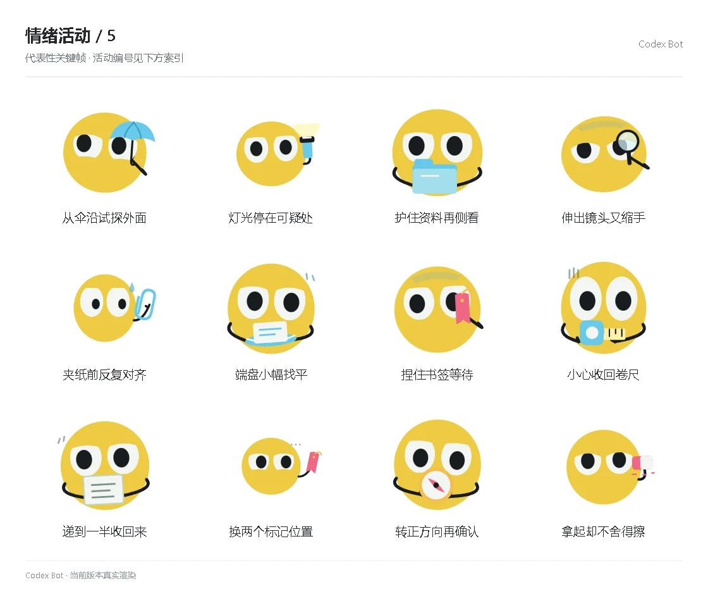

# 情绪活动 / 5

[图鉴目录](README.md) · [项目首页](../../README.md) · [上一页](emotion-04.md) · [下一页](emotion-06.md)

| 活动 | 编号 | 基准时长 |
| --- | --- | ---: |
| 从伞沿试探外面 | `activity_umbrella_peek` | 8.80 秒 |
| 灯光停在可疑处 | `activity_light_stop` | 9.50 秒 |
| 护住资料再侧看 | `activity_folder_guard` | 10.20 秒 |
| 伸出镜头又缩手 | `activity_lens_retreat` | 8.80 秒 |
| 夹纸前反复对齐 | `activity_clip_retry` | 8.80 秒 |
| 端盘小幅找平 | `activity_tray_balance` | 9.50 秒 |
| 捏住书签等待 | `activity_bookmark_grip` | 10.20 秒 |
| 小心收回卷尺 | `activity_measure_care` | 8.80 秒 |
| 递到一半收回来 | `activity_card_half` | 8.80 秒 |
| 换两个标记位置 | `activity_bookmark_choice` | 9.50 秒 |
| 转正方向再确认 | `activity_compass_check` | 10.20 秒 |
| 拿起却不舍得擦 | `activity_eraser_spare` | 8.80 秒 |

[图鉴目录](README.md) · [项目首页](../../README.md) · [上一页](emotion-04.md) · [下一页](emotion-06.md)
