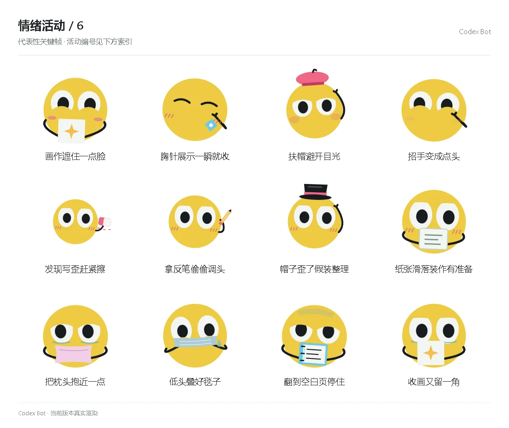

# 情绪活动 / 6

[图鉴目录](README.md) · [项目首页](../../README.md) · [上一页](emotion-05.md) · [下一页](emotion-07.md)

| 活动 | 编号 | 基准时长 |
| --- | --- | ---: |
| 画作遮住一点脸 | `activity_drawing_hide` | 8.80 秒 |
| 胸针展示一瞬就收 | `activity_brooch_flash` | 9.50 秒 |
| 扶帽避开目光 | `activity_beret_avoid` | 10.20 秒 |
| 招手变成点头 | `activity_wave_to_nod` | 8.80 秒 |
| 发现写歪赶紧擦 | `activity_erase_crooked` | 8.80 秒 |
| 拿反笔偷偷调头 | `activity_pencil_wrong` | 9.50 秒 |
| 帽子歪了假装整理 | `activity_hat_excuse` | 10.20 秒 |
| 纸张滑落装作有准备 | `activity_card_slip` | 8.80 秒 |
| 把枕头抱近一点 | `activity_pillow_hug` | 8.80 秒 |
| 低头叠好毯子 | `activity_blanket_fold` | 9.50 秒 |
| 翻到空白页停住 | `activity_blank_page` | 10.20 秒 |
| 收画又留一角 | `activity_drawing_corner` | 8.80 秒 |

[图鉴目录](README.md) · [项目首页](../../README.md) · [上一页](emotion-05.md) · [下一页](emotion-07.md)
