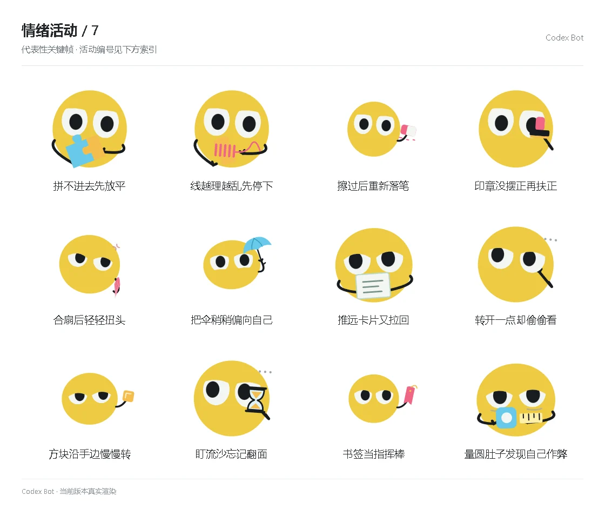

# 情绪活动 / 7

[图鉴目录](README.md) · [项目首页](../../README.md) · [上一页](emotion-06.md) · [下一页](emotion-08.md)

| 活动 | 编号 | 基准时长 |
| --- | --- | ---: |
| 拼不进去先放平 | `activity_puzzle_flat` | 8.80 秒 |
| 线越理越乱先停下 | `activity_spool_tangle` | 9.50 秒 |
| 擦过后重新落笔 | `activity_erase_again` | 10.20 秒 |
| 印章没摆正再扶正 | `activity_stamp_straight` | 8.80 秒 |
| 合扇后轻轻扭头 | `activity_fan_turnaway` | 8.80 秒 |
| 把伞稍稍偏向自己 | `activity_umbrella_self` | 9.50 秒 |
| 推远卡片又拉回 | `activity_card_pushback` | 10.20 秒 |
| 转开一点却偷偷看 | `activity_turn_peek` | 8.80 秒 |
| 方块沿手边慢慢转 | `activity_cube_edge` | 8.80 秒 |
| 盯流沙忘记翻面 | `activity_sand_forgot` | 9.50 秒 |
| 书签当指挥棒 | `activity_bookmark_conduct` | 10.20 秒 |
| 量圆肚子发现自己作弊 | `activity_measure_body` | 8.80 秒 |

[图鉴目录](README.md) · [项目首页](../../README.md) · [上一页](emotion-06.md) · [下一页](emotion-08.md)
