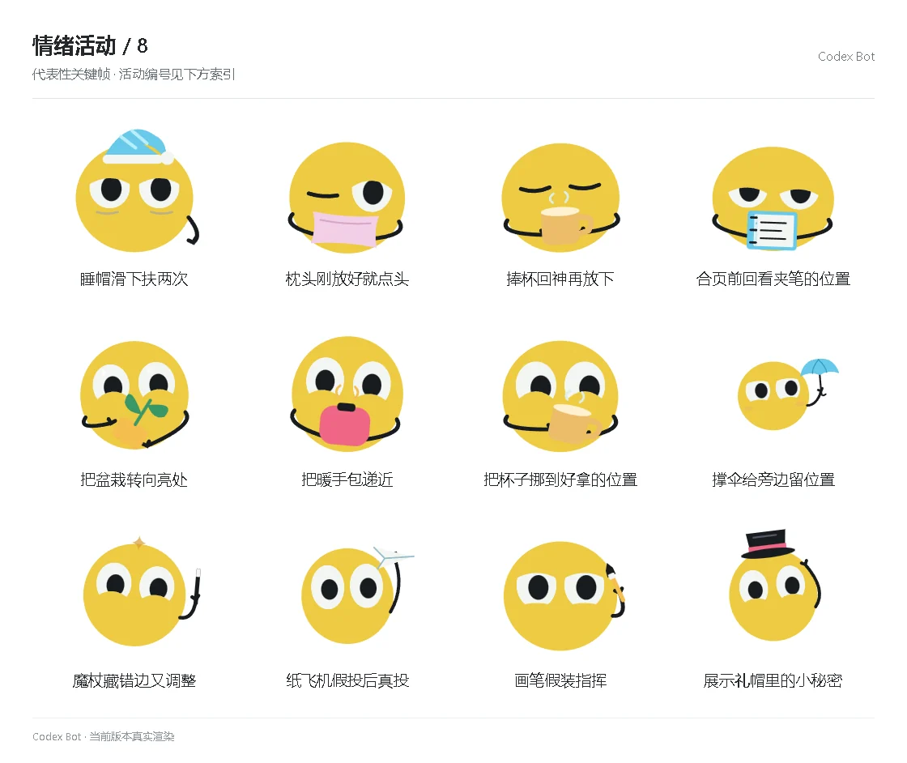

# 情绪活动 / 8

[图鉴目录](README.md) · [项目首页](../../README.md) · [上一页](emotion-07.md)

| 活动 | 编号 | 基准时长 |
| --- | --- | ---: |
| 睡帽滑下扶两次 | `activity_hat_twice` | 8.80 秒 |
| 枕头刚放好就点头 | `activity_pillow_nod` | 9.50 秒 |
| 捧杯回神再放下 | `activity_cup_wake` | 10.20 秒 |
| 合页前回看夹笔的位置 | `activity_notes_pen` | 8.80 秒 |
| 把盆栽转向亮处 | `activity_plant_light` | 8.80 秒 |
| 把暖手包递近 | `activity_warmer_offer` | 9.50 秒 |
| 把杯子挪到好拿的位置 | `activity_cup_near` | 10.20 秒 |
| 撑伞给旁边留位置 | `activity_umbrella_space` | 8.80 秒 |
| 魔杖藏错边又调整 | `activity_wand_wrong` | 8.80 秒 |
| 纸飞机假投后真投 | `activity_plane_fake` | 9.50 秒 |
| 画笔假装指挥 | `activity_brush_conduct` | 10.20 秒 |
| 展示礼帽里的小秘密 | `activity_hat_spark` | 8.80 秒 |

[图鉴目录](README.md) · [项目首页](../../README.md) · [上一页](emotion-07.md)
