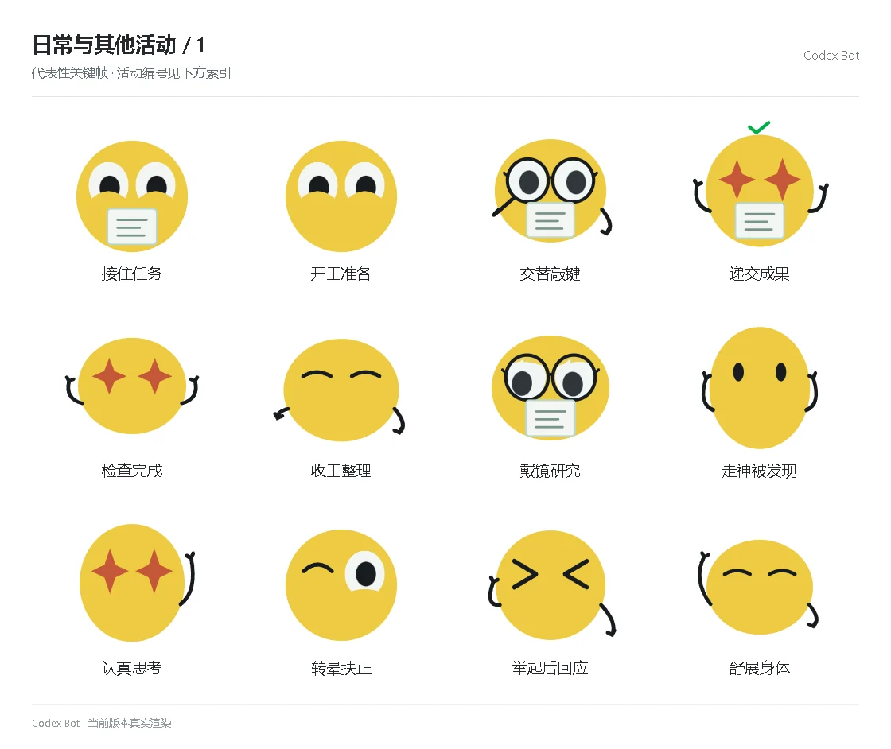

# 日常与其他活动 / 1

[图鉴目录](README.md) · [项目首页](../../README.md) · [下一页](everyday-02.md)

| 活动 | 编号 | 基准时长 |
| --- | --- | ---: |
| 接住任务 | `receive` | 1.90 秒 |
| 开工准备 | `prepare` | 1.20 秒 |
| 交替敲键 | `keyboard` | 1.90 秒 |
| 递交成果 | `deliver` | 1.80 秒 |
| 检查完成 | `finish_check` | 2.10 秒 |
| 收工整理 | `pack_up` | 1.70 秒 |
| 戴镜研究 | `research` | 2.82 秒 |
| 走神被发现 | `caught` | 1.62 秒 |
| 认真思考 | `ponder` | 2.27 秒 |
| 转晕扶正 | `dizzy` | 1.90 秒 |
| 举起后回应 | `lifted` | 1.30 秒 |
| 舒展身体 | `stretch` | 2.20 秒 |

[图鉴目录](README.md) · [项目首页](../../README.md) · [下一页](everyday-02.md)
