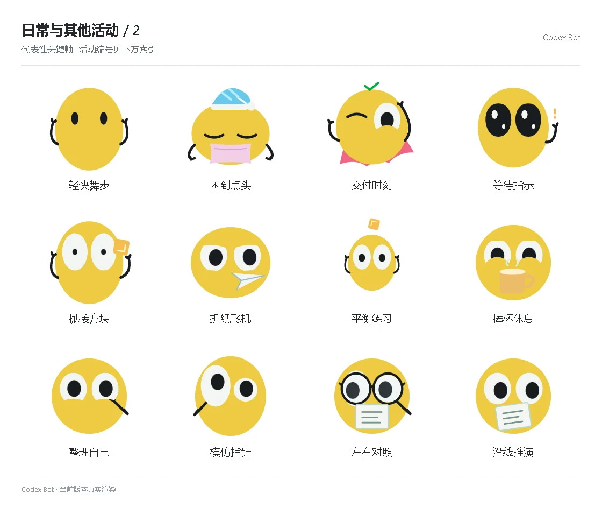

# 日常与其他活动 / 2

[图鉴目录](README.md) · [项目首页](../../README.md) · [上一页](everyday-01.md) · [下一页](everyday-03.md)

| 活动 | 编号 | 基准时长 |
| --- | --- | ---: |
| 轻快舞步 | `dance` | 2.36 秒 |
| 困到点头 | `nap` | 3.00 秒 |
| 交付时刻 | `hero` | 2.50 秒 |
| 等待指示 | `attention` | 2.22 秒 |
| 抛接方块 | `toss` | 2.25 秒 |
| 折纸飞机 | `fold` | 2.45 秒 |
| 平衡练习 | `balance` | 2.20 秒 |
| 捧杯休息 | `cup` | 2.30 秒 |
| 整理自己 | `tidy` | 1.80 秒 |
| 模仿指针 | `mimic` | 2.10 秒 |
| 左右对照 | `compare` | 2.40 秒 |
| 沿线推演 | `trace` | 2.50 秒 |

[图鉴目录](README.md) · [项目首页](../../README.md) · [上一页](everyday-01.md) · [下一页](everyday-03.md)
