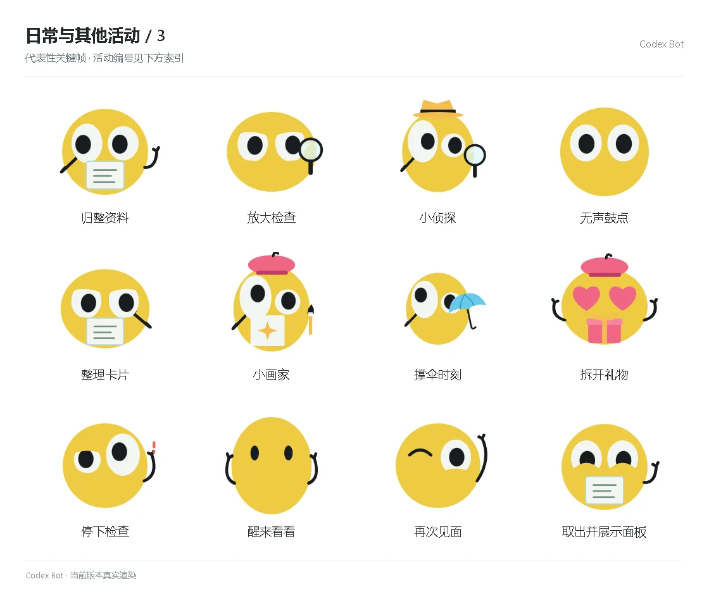

# 日常与其他活动 / 3

[图鉴目录](README.md) · [项目首页](../../README.md) · [上一页](everyday-02.md) · [下一页](everyday-04.md)

| 活动 | 编号 | 基准时长 |
| --- | --- | ---: |
| 归整资料 | `organize` | 2.30 秒 |
| 放大检查 | `inspect` | 2.50 秒 |
| 小侦探 | `detective` | 2.60 秒 |
| 无声鼓点 | `drums` | 1.65 秒 |
| 整理卡片 | `cards` | 2.25 秒 |
| 小画家 | `paint` | 2.75 秒 |
| 撑伞时刻 | `rain` | 2.70 秒 |
| 拆开礼物 | `gift` | 2.65 秒 |
| 停下检查 | `failed` | 1.65 秒 |
| 醒来看看 | `wake` | 1.15 秒 |
| 再次见面 | `greet` | 1.10 秒 |
| 取出并展示面板 | `panel_takeout` | 1.10 秒 |

[图鉴目录](README.md) · [项目首页](../../README.md) · [上一页](everyday-02.md) · [下一页](everyday-04.md)
