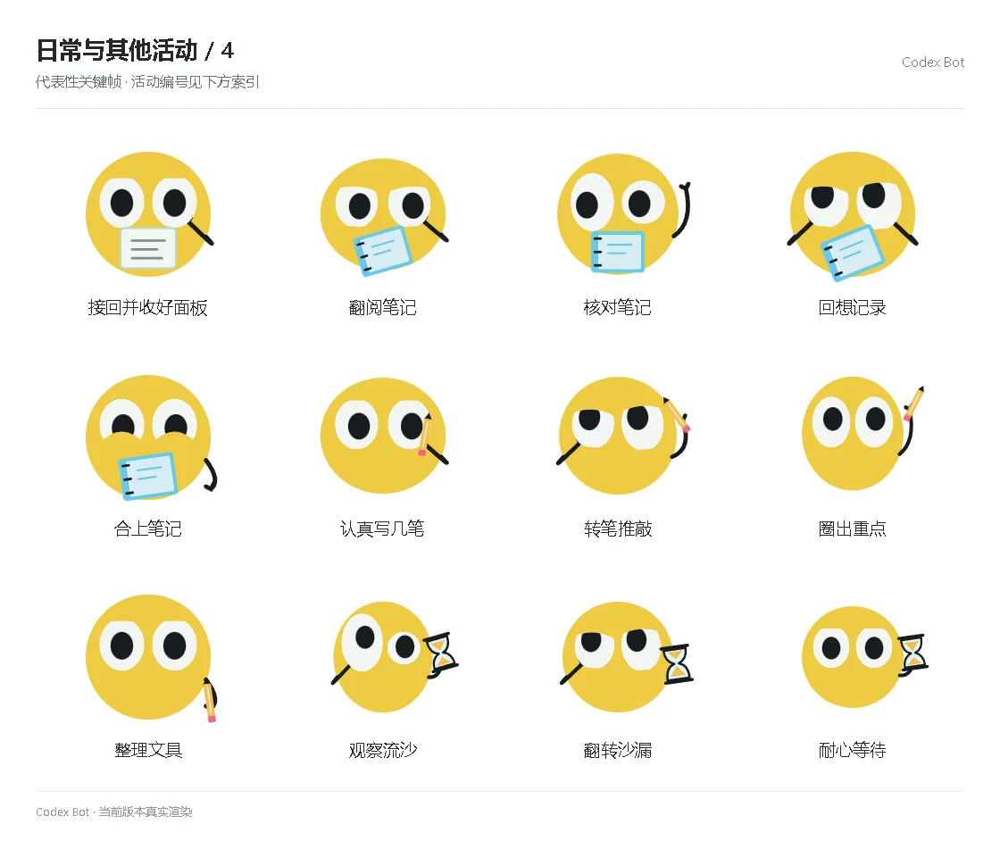

# 日常与其他活动 / 4

[图鉴目录](README.md) · [项目首页](../../README.md) · [上一页](everyday-03.md) · [下一页](everyday-05.md)

| 活动 | 编号 | 基准时长 |
| --- | --- | ---: |
| 接回并收好面板 | `panel_putaway` | 1.04 秒 |
| 翻阅笔记 | `read_notes` | 2.25 秒 |
| 核对笔记 | `compare_notes` | 2.25 秒 |
| 回想记录 | `remember_notes` | 2.25 秒 |
| 合上笔记 | `close_notes` | 2.25 秒 |
| 认真写几笔 | `write_notes` | 2.25 秒 |
| 转笔推敲 | `pencil_think` | 2.25 秒 |
| 圈出重点 | `pencil_point` | 2.25 秒 |
| 整理文具 | `pencil_stow` | 2.25 秒 |
| 观察流沙 | `sand_watch` | 2.25 秒 |
| 翻转沙漏 | `sand_turn` | 2.25 秒 |
| 耐心等待 | `sand_wait` | 2.25 秒 |

[图鉴目录](README.md) · [项目首页](../../README.md) · [上一页](everyday-03.md) · [下一页](everyday-05.md)
