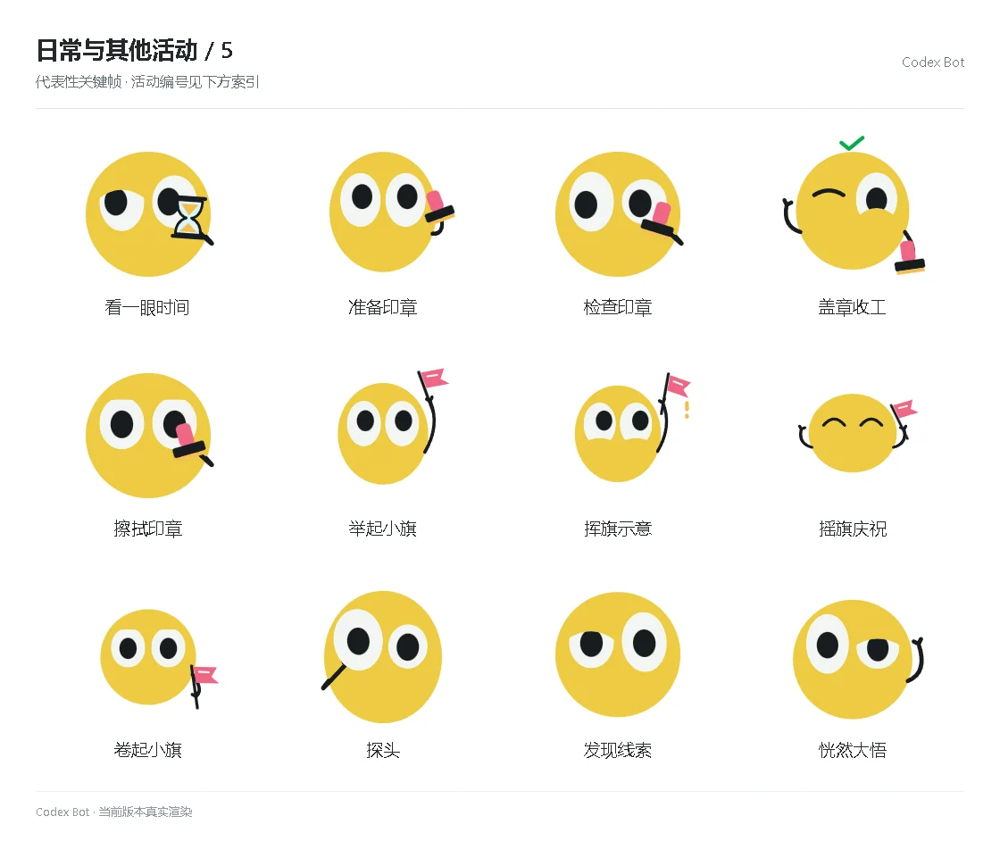

# 日常与其他活动 / 5

[图鉴目录](README.md) · [项目首页](../../README.md) · [上一页](everyday-04.md) · [下一页](everyday-06.md)

| 活动 | 编号 | 基准时长 |
| --- | --- | ---: |
| 看一眼时间 | `sand_check` | 2.25 秒 |
| 准备印章 | `stamp_ready` | 2.25 秒 |
| 检查印章 | `stamp_check` | 2.25 秒 |
| 盖章收工 | `stamp_done` | 2.25 秒 |
| 擦拭印章 | `stamp_clean` | 2.25 秒 |
| 举起小旗 | `flag_ready` | 2.25 秒 |
| 挥旗示意 | `flag_wave` | 2.25 秒 |
| 摇旗庆祝 | `flag_cheer` | 2.25 秒 |
| 卷起小旗 | `flag_stow` | 2.25 秒 |
| 探头 | `emotion_explore_0` | 1.68 秒 |
| 发现线索 | `emotion_explore_1` | 1.68 秒 |
| 恍然大悟 | `emotion_explore_2` | 1.68 秒 |

[图鉴目录](README.md) · [项目首页](../../README.md) · [上一页](everyday-04.md) · [下一页](everyday-06.md)
