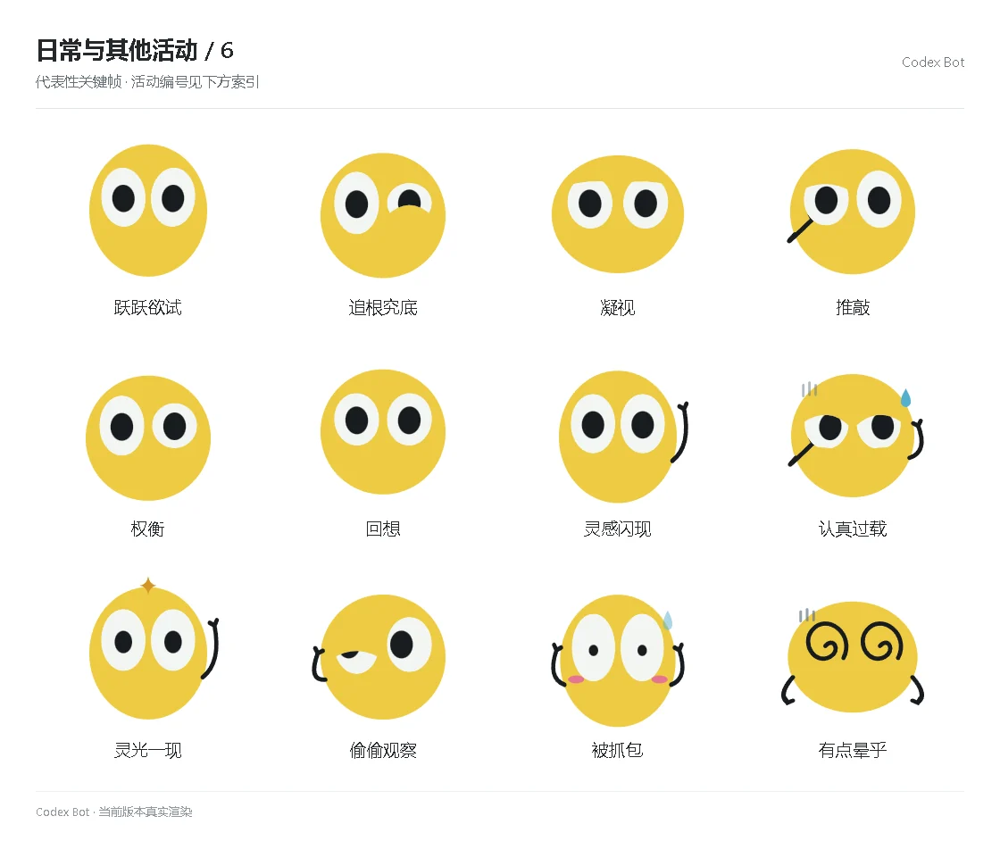

# 日常与其他活动 / 6

[图鉴目录](README.md) · [项目首页](../../README.md) · [上一页](everyday-05.md) · [下一页](everyday-07.md)

| 活动 | 编号 | 基准时长 |
| --- | --- | ---: |
| 跃跃欲试 | `emotion_explore_3` | 1.68 秒 |
| 追根究底 | `emotion_explore_4` | 1.68 秒 |
| 凝视 | `emotion_deliberate_0` | 1.68 秒 |
| 推敲 | `emotion_deliberate_1` | 1.68 秒 |
| 权衡 | `emotion_deliberate_2` | 1.68 秒 |
| 回想 | `emotion_deliberate_3` | 1.68 秒 |
| 灵感闪现 | `emotion_deliberate_4` | 1.68 秒 |
| 认真过载 | `special_overload` | 4.34 秒 |
| 灵光一现 | `special_eureka` | 4.34 秒 |
| 偷偷观察 | `special_covert` | 4.34 秒 |
| 被抓包 | `special_caught_red` | 4.34 秒 |
| 有点晕乎 | `special_unravel` | 4.34 秒 |

[图鉴目录](README.md) · [项目首页](../../README.md) · [上一页](everyday-05.md) · [下一页](everyday-07.md)
