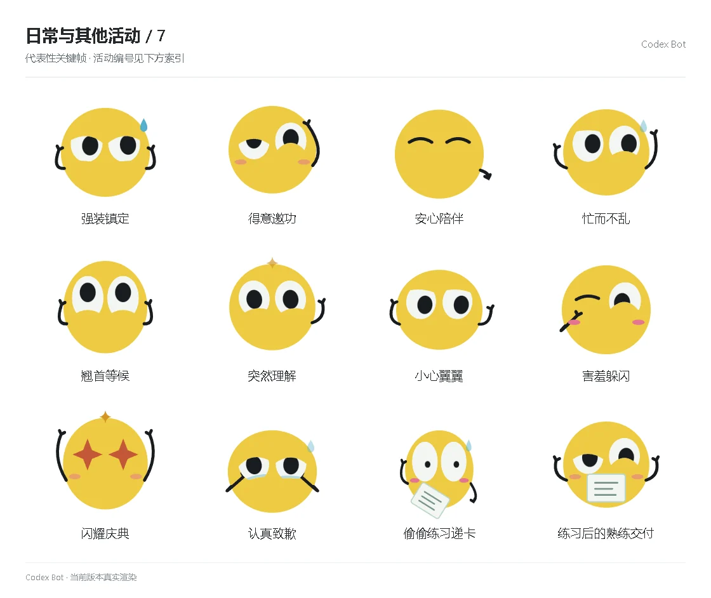

# 日常与其他活动 / 7

[图鉴目录](README.md) · [项目首页](../../README.md) · [上一页](everyday-06.md) · [下一页](everyday-08.md)

| 活动 | 编号 | 基准时长 |
| --- | --- | ---: |
| 强装镇定 | `special_composed` | 4.34 秒 |
| 得意邀功 | `special_smug` | 4.34 秒 |
| 安心陪伴 | `special_companion` | 4.34 秒 |
| 忙而不乱 | `special_juggling` | 4.34 秒 |
| 翘首等候 | `special_expectant` | 4.34 秒 |
| 突然理解 | `special_understood` | 4.34 秒 |
| 小心翼翼 | `special_gingerly` | 4.34 秒 |
| 害羞躲闪 | `special_bashful` | 4.34 秒 |
| 闪耀庆典 | `special_jubilant` | 4.34 秒 |
| 认真致歉 | `special_apologetic` | 4.34 秒 |
| 偷偷练习递卡 | `story_practice` | 5.25 秒 |
| 练习后的熟练交付 | `story_delivery` | 3.40 秒 |

[图鉴目录](README.md) · [项目首页](../../README.md) · [上一页](everyday-06.md) · [下一页](everyday-08.md)
