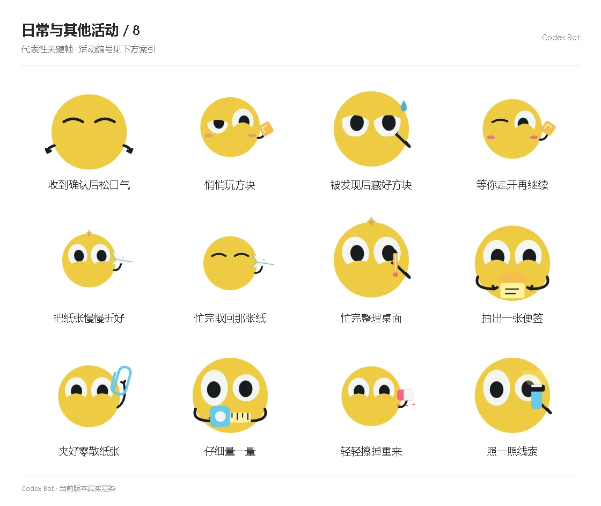

# 日常与其他活动 / 8

[图鉴目录](README.md) · [项目首页](../../README.md) · [上一页](everyday-07.md) · [下一页](everyday-09.md)

| 活动 | 编号 | 基准时长 |
| --- | --- | ---: |
| 收到确认后松口气 | `story_acknowledge` | 1.50 秒 |
| 悄悄玩方块 | `story_fidget` | 4.25 秒 |
| 被发现后藏好方块 | `story_hide_cube` | 1.85 秒 |
| 等你走开再继续 | `story_resume_cube` | 4.20 秒 |
| 把纸张慢慢折好 | `story_letter` | 4.95 秒 |
| 忙完取回那张纸 | `story_return_letter` | 4.45 秒 |
| 忙完整理桌面 | `story_cleanup` | 5.05 秒 |
| 抽出一张便签 | `prop_stickyRoll` | 5.25 秒 |
| 夹好零散纸张 | `prop_paperclip` | 5.25 秒 |
| 仔细量一量 | `prop_tapeMeasure` | 5.25 秒 |
| 轻轻擦掉重来 | `prop_eraser` | 5.25 秒 |
| 照一照线索 | `prop_flashlight` | 5.25 秒 |

[图鉴目录](README.md) · [项目首页](../../README.md) · [上一页](everyday-07.md) · [下一页](everyday-09.md)
