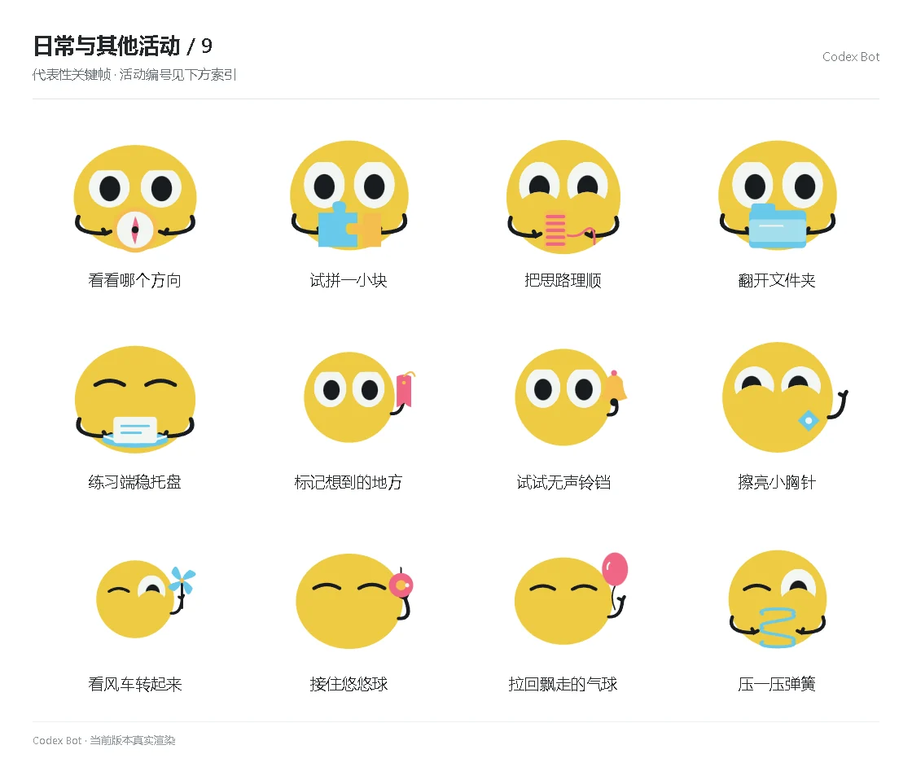

# 日常与其他活动 / 9

[图鉴目录](README.md) · [项目首页](../../README.md) · [上一页](everyday-08.md) · [下一页](everyday-10.md)

| 活动 | 编号 | 基准时长 |
| --- | --- | ---: |
| 看看哪个方向 | `prop_compass` | 5.25 秒 |
| 试拼一小块 | `prop_puzzle` | 5.25 秒 |
| 把思路理顺 | `prop_spool` | 5.25 秒 |
| 翻开文件夹 | `prop_folder` | 5.25 秒 |
| 练习端稳托盘 | `prop_tray` | 5.25 秒 |
| 标记想到的地方 | `prop_bookmark` | 5.25 秒 |
| 试试无声铃铛 | `prop_bell` | 5.25 秒 |
| 擦亮小胸针 | `prop_brooch` | 5.25 秒 |
| 看风车转起来 | `prop_pinwheel` | 5.25 秒 |
| 接住悠悠球 | `prop_yoyo` | 5.25 秒 |
| 拉回飘走的气球 | `prop_balloon` | 5.25 秒 |
| 压一压弹簧 | `prop_springToy` | 5.25 秒 |

[图鉴目录](README.md) · [项目首页](../../README.md) · [上一页](everyday-08.md) · [下一页](everyday-10.md)
