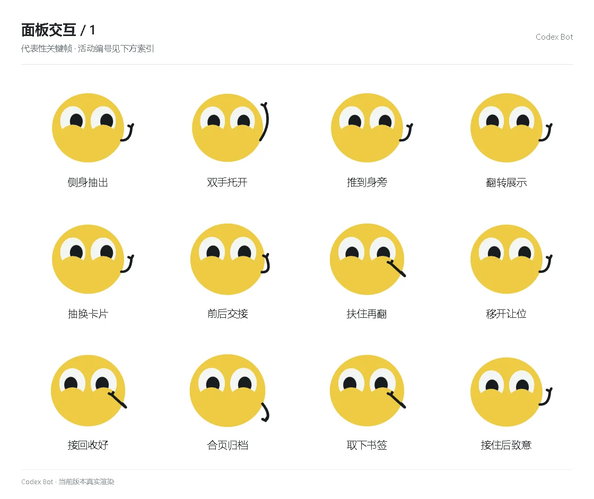

# 面板交互 / 1

[图鉴目录](README.md) · [项目首页](../../README.md) · [下一页](panel-02.md)

| 活动 | 编号 | 基准时长 |
| --- | --- | ---: |
| 侧身抽出 | `panel_activity_side_draw` | 1.30 秒 |
| 双手托开 | `panel_activity_two_hands` | 1.30 秒 |
| 推到身旁 | `panel_activity_push_side` | 1.30 秒 |
| 翻转展示 | `panel_activity_flip_show` | 1.30 秒 |
| 抽换卡片 | `panel_activity_replace` | 1.30 秒 |
| 前后交接 | `panel_activity_handoff` | 1.30 秒 |
| 扶住再翻 | `panel_activity_support_flip` | 1.30 秒 |
| 移开让位 | `panel_activity_make_way` | 1.30 秒 |
| 接回收好 | `panel_activity_receive` | 1.30 秒 |
| 合页归档 | `panel_activity_archive` | 1.30 秒 |
| 取下书签 | `panel_activity_unmark` | 1.30 秒 |
| 接住后致意 | `panel_activity_thanks` | 1.30 秒 |

[图鉴目录](README.md) · [项目首页](../../README.md) · [下一页](panel-02.md)
