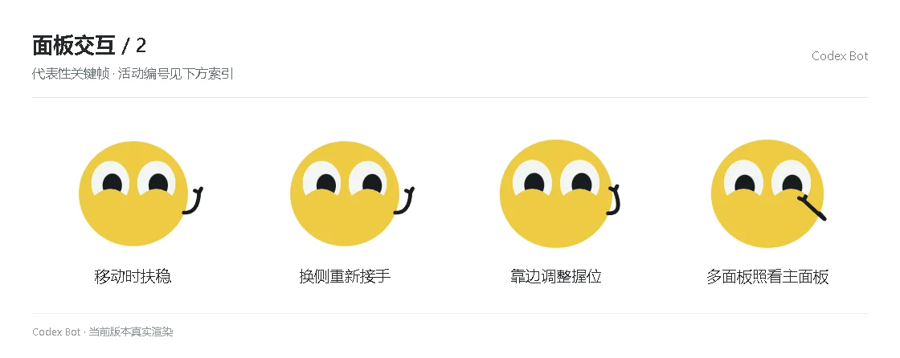

# 面板交互 / 2

[图鉴目录](README.md) · [项目首页](../../README.md) · [上一页](panel-01.md)

| 活动 | 编号 | 基准时长 |
| --- | --- | ---: |
| 移动时扶稳 | `panel_activity_steady` | 1.30 秒 |
| 换侧重新接手 | `panel_activity_change_side` | 1.30 秒 |
| 靠边调整握位 | `panel_activity_edge_grip` | 1.30 秒 |
| 多面板照看主面板 | `panel_activity_main_only` | 1.30 秒 |

[图鉴目录](README.md) · [项目首页](../../README.md) · [上一页](panel-01.md)
