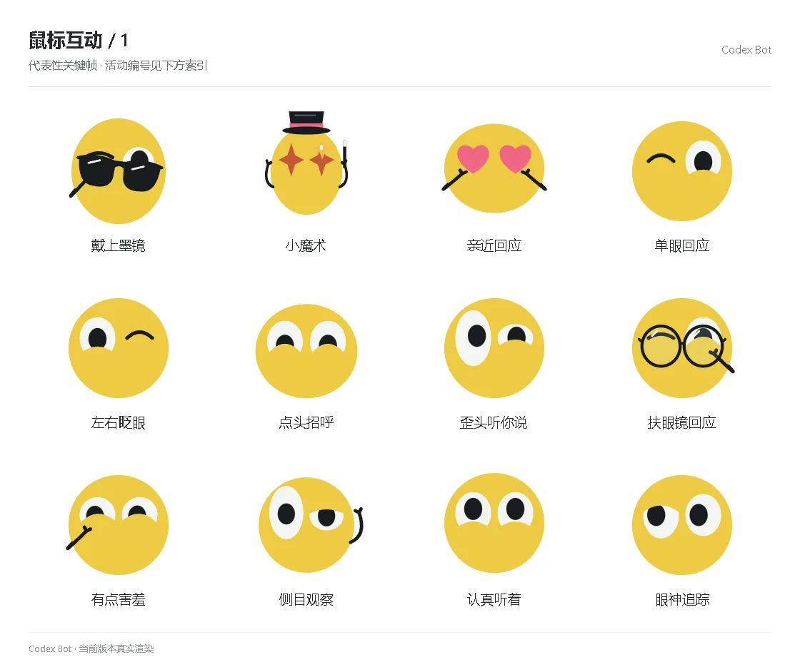

# 鼠标互动 / 1

[图鉴目录](README.md) · [项目首页](../../README.md) · [下一页](social-02.md)

| 活动 | 编号 | 基准时长 |
| --- | --- | ---: |
| 戴上墨镜 | `shades` | 3.05 秒 |
| 小魔术 | `magic` | 3.40 秒 |
| 亲近回应 | `affection` | 1.85 秒 |
| 单眼回应 | `wink_ack` | 1.10 秒 |
| 左右眨眼 | `double_blink` | 1.10 秒 |
| 点头招呼 | `nod_hello` | 1.10 秒 |
| 歪头听你说 | `head_tilt` | 1.10 秒 |
| 扶眼镜回应 | `glasses_tap` | 1.10 秒 |
| 有点害羞 | `shy_reply` | 1.10 秒 |
| 侧目观察 | `side_inspect` | 1.10 秒 |
| 认真听着 | `listen_close` | 1.10 秒 |
| 眼神追踪 | `eye_follow` | 1.10 秒 |

[图鉴目录](README.md) · [项目首页](../../README.md) · [下一页](social-02.md)
