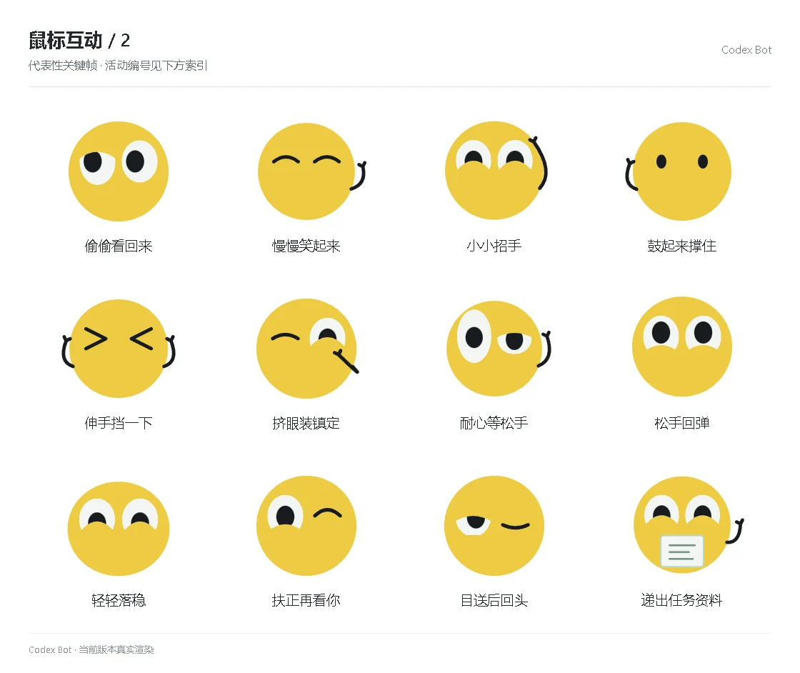

# 鼠标互动 / 2

[图鉴目录](README.md) · [项目首页](../../README.md) · [上一页](social-01.md) · [下一页](social-03.md)

| 活动 | 编号 | 基准时长 |
| --- | --- | ---: |
| 偷偷看回来 | `peek_back` | 1.10 秒 |
| 慢慢笑起来 | `slow_smile` | 1.10 秒 |
| 小小招手 | `finger_wave` | 1.10 秒 |
| 鼓起来撑住 | `puff_hold` | 1.10 秒 |
| 伸手挡一下 | `brace_hold` | 1.10 秒 |
| 挤眼装镇定 | `squish_hold` | 1.10 秒 |
| 耐心等松手 | `patient_hold` | 1.10 秒 |
| 松手回弹 | `spring_back` | 1.10 秒 |
| 轻轻落稳 | `smooth_landing` | 1.10 秒 |
| 扶正再看你 | `shake_off` | 1.10 秒 |
| 目送后回头 | `glance_back` | 1.10 秒 |
| 递出任务资料 | `present_note` | 1.10 秒 |

[图鉴目录](README.md) · [项目首页](../../README.md) · [上一页](social-01.md) · [下一页](social-03.md)
