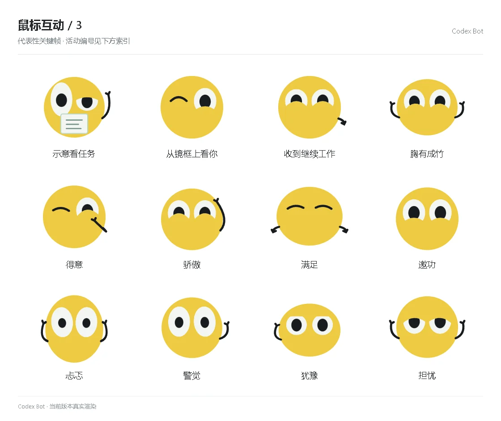

# 鼠标互动 / 3

[图鉴目录](README.md) · [项目首页](../../README.md) · [上一页](social-02.md) · [下一页](social-04.md)

| 活动 | 编号 | 基准时长 |
| --- | --- | ---: |
| 示意看任务 | `point_note` | 1.10 秒 |
| 从镜框上看你 | `glasses_peek` | 1.10 秒 |
| 收到继续工作 | `back_to_work` | 1.10 秒 |
| 胸有成竹 | `emotion_achievement_0` | 1.68 秒 |
| 得意 | `emotion_achievement_1` | 1.68 秒 |
| 骄傲 | `emotion_achievement_2` | 1.68 秒 |
| 满足 | `emotion_achievement_3` | 1.68 秒 |
| 邀功 | `emotion_achievement_4` | 1.68 秒 |
| 忐忑 | `emotion_anxious_0` | 1.68 秒 |
| 警觉 | `emotion_anxious_1` | 1.68 秒 |
| 犹豫 | `emotion_anxious_2` | 1.68 秒 |
| 担忧 | `emotion_anxious_3` | 1.68 秒 |

[图鉴目录](README.md) · [项目首页](../../README.md) · [上一页](social-02.md) · [下一页](social-04.md)
