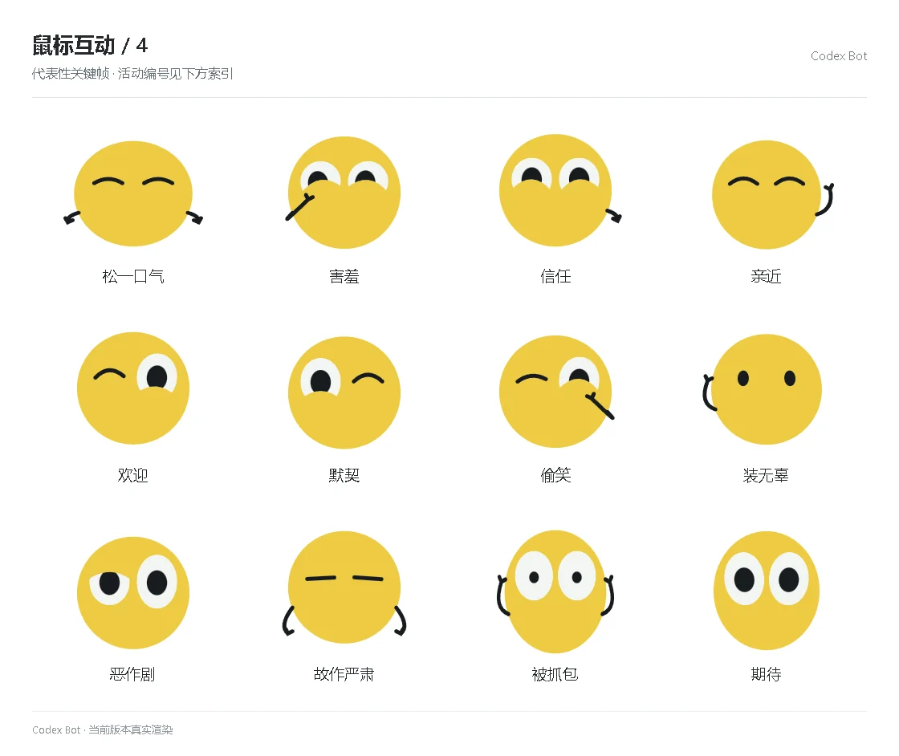

# 鼠标互动 / 4

[图鉴目录](README.md) · [项目首页](../../README.md) · [上一页](social-03.md) · [下一页](social-05.md)

| 活动 | 编号 | 基准时长 |
| --- | --- | ---: |
| 松一口气 | `emotion_anxious_4` | 1.68 秒 |
| 害羞 | `emotion_closeness_0` | 1.68 秒 |
| 信任 | `emotion_closeness_1` | 1.68 秒 |
| 亲近 | `emotion_closeness_2` | 1.68 秒 |
| 欢迎 | `emotion_closeness_3` | 1.68 秒 |
| 默契 | `emotion_closeness_4` | 1.68 秒 |
| 偷笑 | `emotion_playful_0` | 1.68 秒 |
| 装无辜 | `emotion_playful_1` | 1.68 秒 |
| 恶作剧 | `emotion_playful_2` | 1.68 秒 |
| 故作严肃 | `emotion_playful_3` | 1.68 秒 |
| 被抓包 | `emotion_playful_4` | 1.68 秒 |
| 期待 | `emotion_anticipation_0` | 1.68 秒 |

[图鉴目录](README.md) · [项目首页](../../README.md) · [上一页](social-03.md) · [下一页](social-05.md)
