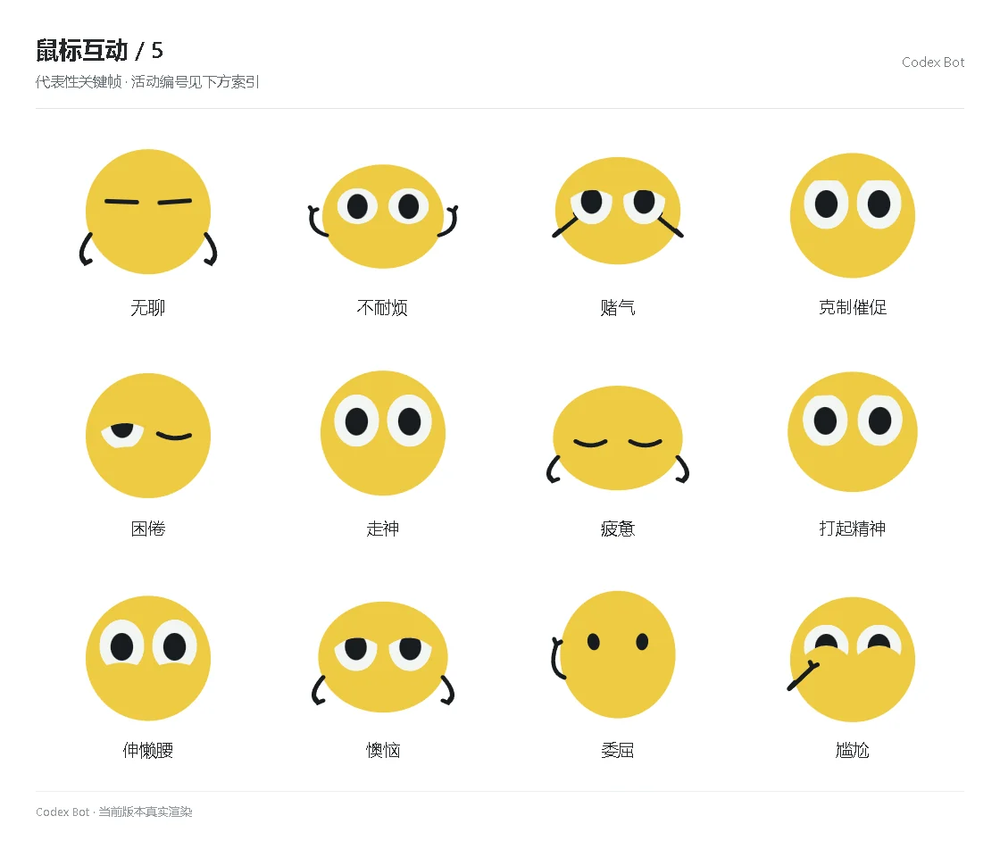

# 鼠标互动 / 5

[图鉴目录](README.md) · [项目首页](../../README.md) · [上一页](social-04.md) · [下一页](social-06.md)

| 活动 | 编号 | 基准时长 |
| --- | --- | ---: |
| 无聊 | `emotion_anticipation_1` | 1.68 秒 |
| 不耐烦 | `emotion_anticipation_2` | 1.68 秒 |
| 赌气 | `emotion_anticipation_3` | 1.68 秒 |
| 克制催促 | `emotion_anticipation_4` | 1.68 秒 |
| 困倦 | `emotion_recovery_0` | 1.68 秒 |
| 走神 | `emotion_recovery_1` | 1.68 秒 |
| 疲惫 | `emotion_recovery_2` | 1.68 秒 |
| 打起精神 | `emotion_recovery_3` | 1.68 秒 |
| 伸懒腰 | `emotion_recovery_4` | 1.68 秒 |
| 懊恼 | `emotion_setback_0` | 1.68 秒 |
| 委屈 | `emotion_setback_1` | 1.68 秒 |
| 尴尬 | `emotion_setback_2` | 1.68 秒 |

[图鉴目录](README.md) · [项目首页](../../README.md) · [上一页](social-04.md) · [下一页](social-06.md)
