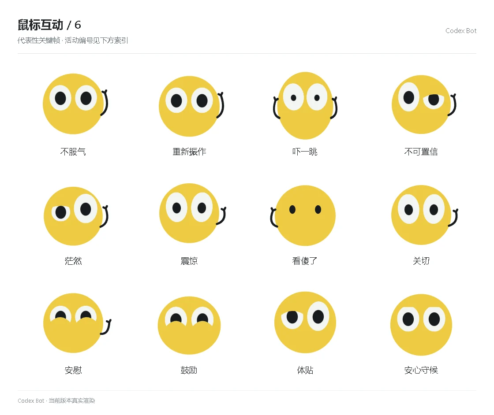

# 鼠标互动 / 6

[图鉴目录](README.md) · [项目首页](../../README.md) · [上一页](social-05.md) · [下一页](social-07.md)

| 活动 | 编号 | 基准时长 |
| --- | --- | ---: |
| 不服气 | `emotion_setback_3` | 1.68 秒 |
| 重新振作 | `emotion_setback_4` | 1.68 秒 |
| 吓一跳 | `emotion_astonished_0` | 1.68 秒 |
| 不可置信 | `emotion_astonished_1` | 1.68 秒 |
| 茫然 | `emotion_astonished_2` | 1.68 秒 |
| 震惊 | `emotion_astonished_3` | 1.68 秒 |
| 看傻了 | `emotion_astonished_4` | 1.68 秒 |
| 关切 | `emotion_caring_0` | 1.68 秒 |
| 安慰 | `emotion_caring_1` | 1.68 秒 |
| 鼓励 | `emotion_caring_2` | 1.68 秒 |
| 体贴 | `emotion_caring_3` | 1.68 秒 |
| 安心守候 | `emotion_caring_4` | 1.68 秒 |

[图鉴目录](README.md) · [项目首页](../../README.md) · [上一页](social-05.md) · [下一页](social-07.md)
