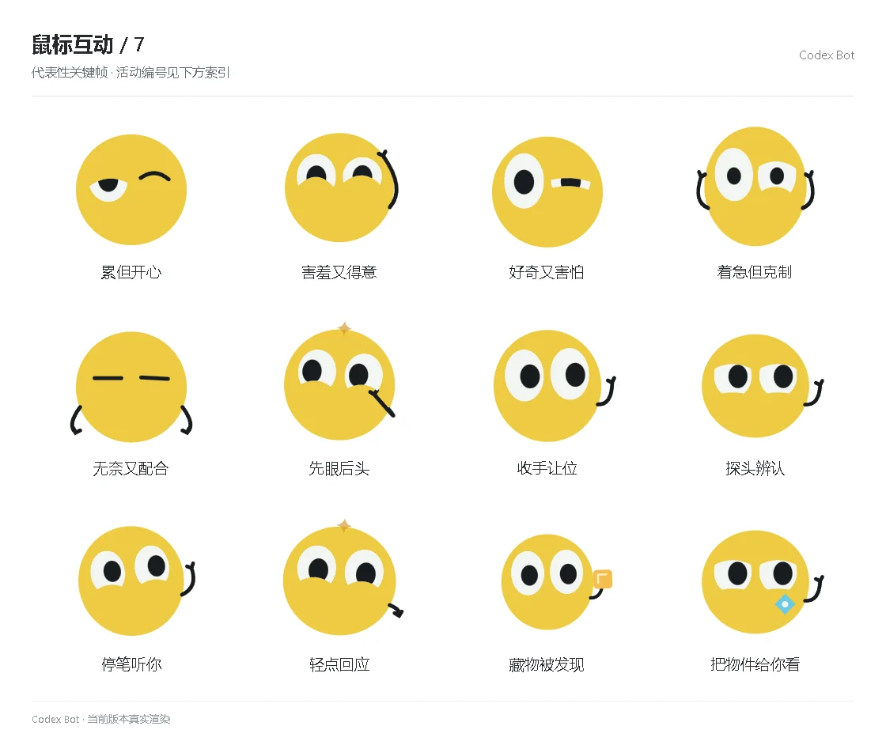

# 鼠标互动 / 7

[图鉴目录](README.md) · [项目首页](../../README.md) · [上一页](social-06.md) · [下一页](social-08.md)

| 活动 | 编号 | 基准时长 |
| --- | --- | ---: |
| 累但开心 | `emotion_mixed_0` | 1.68 秒 |
| 害羞又得意 | `emotion_mixed_1` | 1.68 秒 |
| 好奇又害怕 | `emotion_mixed_2` | 1.68 秒 |
| 着急但克制 | `emotion_mixed_3` | 1.68 秒 |
| 无奈又配合 | `emotion_mixed_4` | 1.68 秒 |
| 先眼后头 | `social_activity_eyes_first` | 3.95 秒 |
| 收手让位 | `social_activity_hands_aside` | 3.95 秒 |
| 探头辨认 | `social_activity_recognize` | 3.95 秒 |
| 停笔听你 | `social_activity_listen_pause` | 3.95 秒 |
| 轻点回应 | `social_activity_tap_reply` | 3.95 秒 |
| 藏物被发现 | `social_activity_caught_hiding` | 3.95 秒 |
| 把物件给你看 | `social_activity_show_you` | 3.95 秒 |

[图鉴目录](README.md) · [项目首页](../../README.md) · [上一页](social-06.md) · [下一页](social-08.md)
