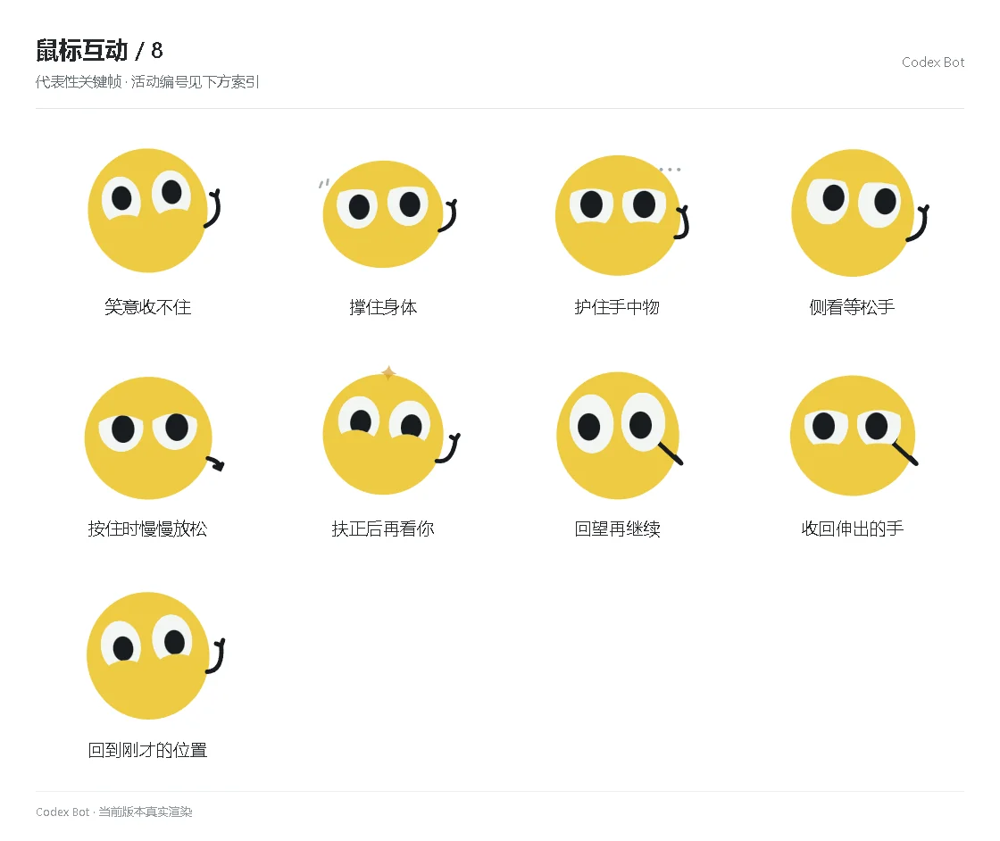

# 鼠标互动 / 8

[图鉴目录](README.md) · [项目首页](../../README.md) · [上一页](social-07.md)

| 活动 | 编号 | 基准时长 |
| --- | --- | ---: |
| 笑意收不住 | `social_activity_smile_spill` | 3.95 秒 |
| 撑住身体 | `social_activity_support_body` | 3.95 秒 |
| 护住手中物 | `social_activity_guard_object` | 3.95 秒 |
| 侧看等松手 | `social_activity_wait_release` | 3.95 秒 |
| 按住时慢慢放松 | `social_activity_gradual_relax` | 3.95 秒 |
| 扶正后再看你 | `social_activity_straighten` | 3.95 秒 |
| 回望再继续 | `social_activity_back_to_it` | 3.95 秒 |
| 收回伸出的手 | `social_activity_take_hand` | 3.95 秒 |
| 回到刚才的位置 | `social_activity_return_place` | 3.95 秒 |

[图鉴目录](README.md) · [项目首页](../../README.md) · [上一页](social-07.md)
