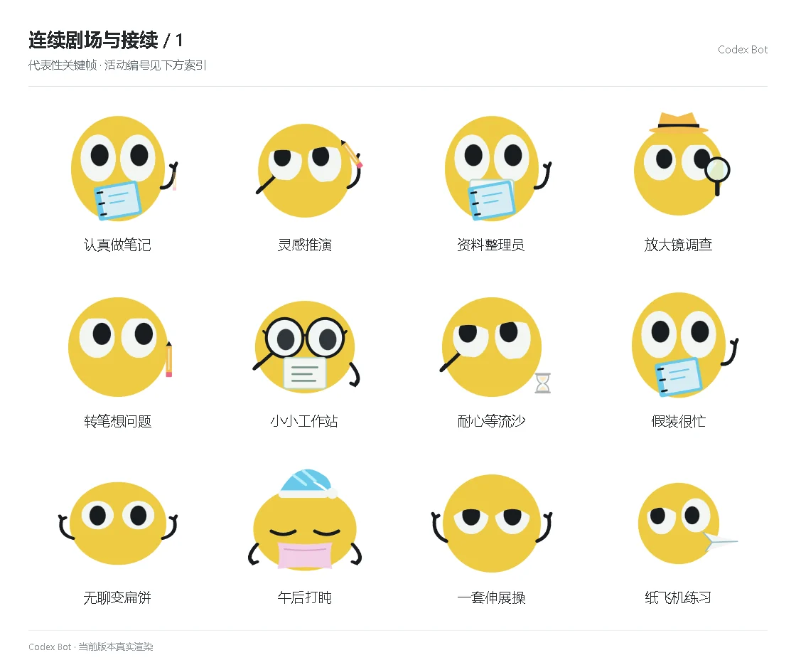

# 连续剧场与接续 / 1

[图鉴目录](README.md) · [项目首页](../../README.md) · [下一页](story-02.md)

| 活动 | 编号 | 基准时长 |
| --- | --- | ---: |
| 认真做笔记 | `theater_notes` | 15.00 秒 |
| 灵感推演 | `theater_insight` | 15.00 秒 |
| 资料整理员 | `theater_sorting` | 15.00 秒 |
| 放大镜调查 | `theater_investigate` | 15.00 秒 |
| 转笔想问题 | `theater_pen` | 15.00 秒 |
| 小小工作站 | `theater_workstation` | 15.00 秒 |
| 耐心等流沙 | `theater_sand` | 15.00 秒 |
| 假装很忙 | `theater_busy` | 15.00 秒 |
| 无聊变扁饼 | `theater_pancake` | 15.00 秒 |
| 午后打盹 | `theater_doze` | 15.00 秒 |
| 一套伸展操 | `theater_exercise` | 15.00 秒 |
| 纸飞机练习 | `theater_airplane` | 15.00 秒 |

[图鉴目录](README.md) · [项目首页](../../README.md) · [下一页](story-02.md)
