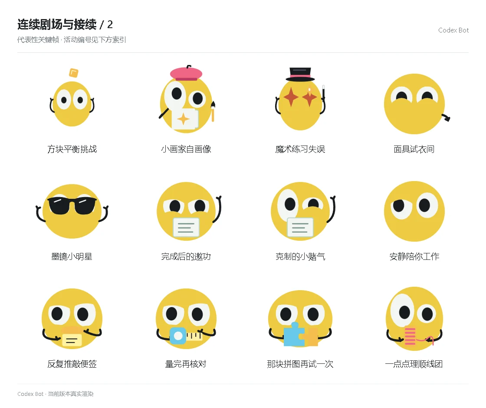

# 连续剧场与接续 / 2

[图鉴目录](README.md) · [项目首页](../../README.md) · [上一页](story-01.md) · [下一页](story-03.md)

| 活动 | 编号 | 基准时长 |
| --- | --- | ---: |
| 方块平衡挑战 | `theater_balance` | 15.00 秒 |
| 小画家自画像 | `theater_portrait` | 15.00 秒 |
| 魔术练习失误 | `theater_magic` | 15.00 秒 |
| 面具试衣间 | `theater_masks` | 15.00 秒 |
| 墨镜小明星 | `theater_star` | 15.00 秒 |
| 完成后的邀功 | `theater_proud` | 15.00 秒 |
| 克制的小赌气 | `theater_patient` | 15.00 秒 |
| 安静陪你工作 | `theater_companion` | 15.00 秒 |
| 反复推敲便签 | `theater_prop_note_roll` | 15.00 秒 |
| 量完再核对 | `theater_prop_measure_twice` | 15.00 秒 |
| 那块拼图再试一次 | `theater_prop_puzzle_retry` | 15.00 秒 |
| 一点点理顺线团 | `theater_prop_unwind` | 15.00 秒 |

[图鉴目录](README.md) · [项目首页](../../README.md) · [上一页](story-01.md) · [下一页](story-03.md)
