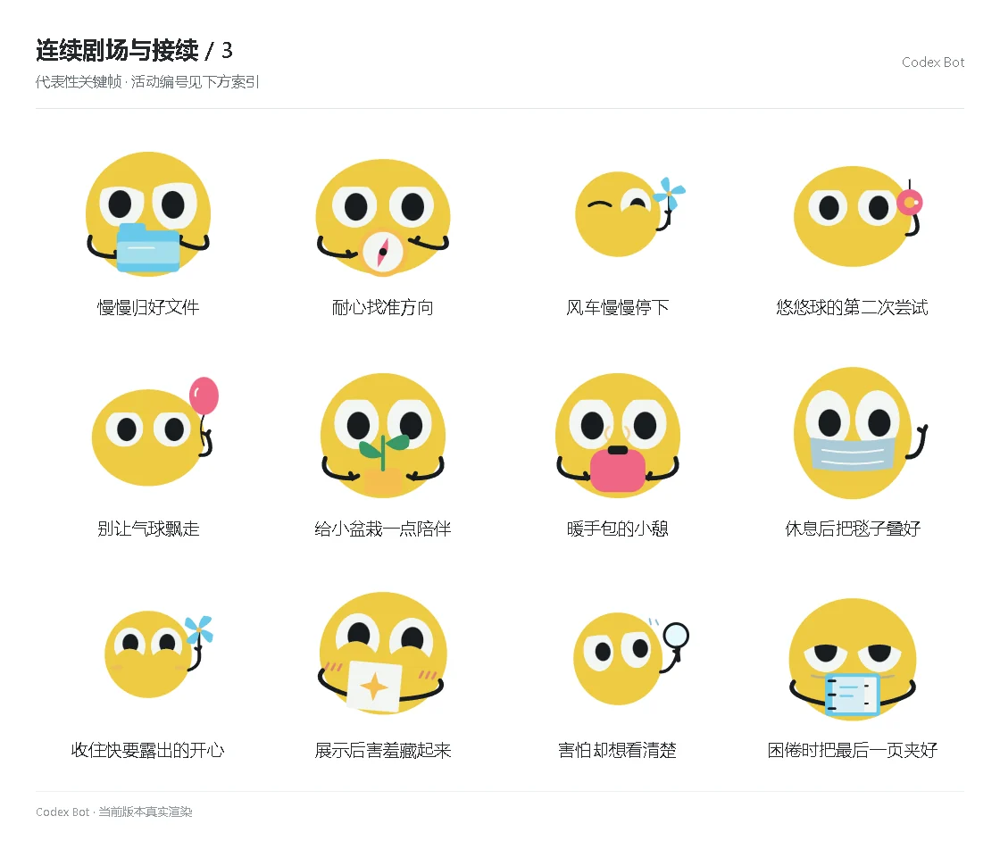

# 连续剧场与接续 / 3

[图鉴目录](README.md) · [项目首页](../../README.md) · [上一页](story-02.md) · [下一页](story-04.md)

| 活动 | 编号 | 基准时长 |
| --- | --- | ---: |
| 慢慢归好文件 | `theater_prop_filing` | 15.00 秒 |
| 耐心找准方向 | `theater_prop_bearings` | 15.00 秒 |
| 风车慢慢停下 | `theater_prop_wind_play` | 15.00 秒 |
| 悠悠球的第二次尝试 | `theater_prop_yoyo_practice` | 15.00 秒 |
| 别让气球飘走 | `theater_prop_balloon_return` | 15.00 秒 |
| 给小盆栽一点陪伴 | `theater_prop_garden` | 15.00 秒 |
| 暖手包的小憩 | `theater_prop_warm_rest` | 15.00 秒 |
| 休息后把毯子叠好 | `theater_prop_blanket_fold` | 15.00 秒 |
| 收住快要露出的开心 | `theater_activity_restrained` | 15.00 秒 |
| 展示后害羞藏起来 | `theater_activity_bashful_pride` | 15.00 秒 |
| 害怕却想看清楚 | `theater_activity_brave_peek` | 15.00 秒 |
| 困倦时把最后一页夹好 | `theater_activity_determined` | 15.00 秒 |

[图鉴目录](README.md) · [项目首页](../../README.md) · [上一页](story-02.md) · [下一页](story-04.md)
