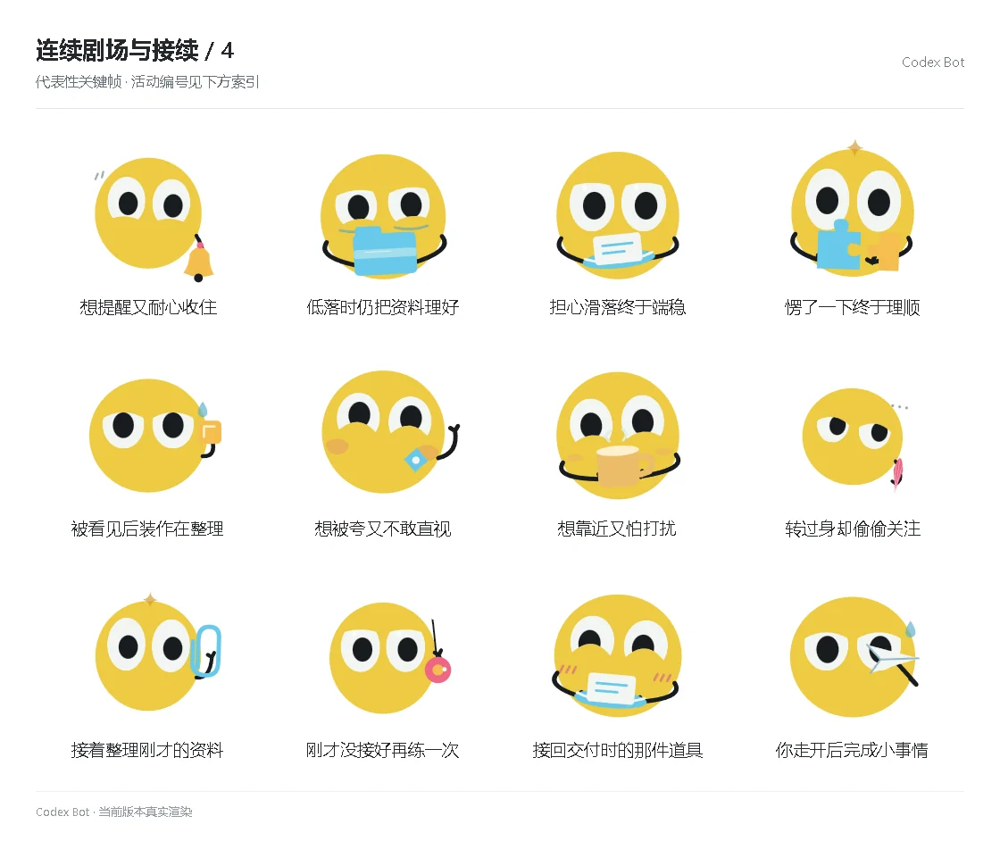

# 连续剧场与接续 / 4

[图鉴目录](README.md) · [项目首页](../../README.md) · [上一页](story-03.md)

| 活动 | 编号 | 基准时长 |
| --- | --- | ---: |
| 想提醒又耐心收住 | `theater_activity_polite_wait` | 15.00 秒 |
| 低落时仍把资料理好 | `theater_activity_help_anyway` | 15.00 秒 |
| 担心滑落终于端稳 | `theater_activity_safe_now` | 15.00 秒 |
| 愣了一下终于理顺 | `theater_activity_understand` | 15.00 秒 |
| 被看见后装作在整理 | `theater_activity_caught` | 15.00 秒 |
| 想被夸又不敢直视 | `theater_activity_praise` | 15.00 秒 |
| 想靠近又怕打扰 | `theater_activity_considerate` | 15.00 秒 |
| 转过身却偷偷关注 | `theater_activity_sulky_watch` | 15.00 秒 |
| 接着整理刚才的资料 | `theater_activity_resume_sort` | 15.00 秒 |
| 刚才没接好再练一次 | `theater_activity_practice_again` | 15.00 秒 |
| 接回交付时的那件道具 | `theater_activity_take_delivery` | 15.00 秒 |
| 你走开后完成小事情 | `theater_activity_finish_private` | 15.00 秒 |

[图鉴目录](README.md) · [项目首页](../../README.md) · [上一页](story-03.md)
