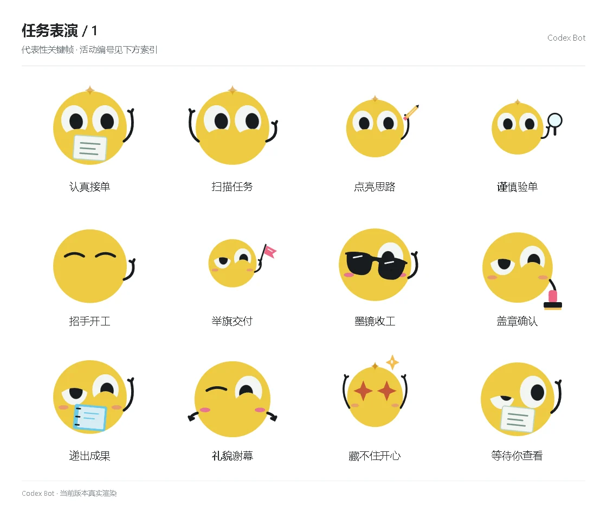

# 任务表演 / 1

[图鉴目录](README.md) · [项目首页](../../README.md) · [下一页](task-02.md)

| 活动 | 编号 | 基准时长 |
| --- | --- | ---: |
| 认真接单 | `performance_start_card` | 4.32 秒 |
| 扫描任务 | `performance_start_scan` | 4.32 秒 |
| 点亮思路 | `performance_start_idea` | 4.32 秒 |
| 谨慎验单 | `performance_start_inspect` | 4.32 秒 |
| 招手开工 | `performance_start_wave` | 4.32 秒 |
| 举旗交付 | `performance_done_flag` | 4.32 秒 |
| 墨镜收工 | `performance_done_shades` | 4.32 秒 |
| 盖章确认 | `performance_done_stamp` | 4.32 秒 |
| 递出成果 | `performance_done_report` | 4.32 秒 |
| 礼貌谢幕 | `performance_done_bow` | 4.32 秒 |
| 藏不住开心 | `performance_done_surprise` | 4.32 秒 |
| 等待你查看 | `performance_done_present` | 4.32 秒 |

[图鉴目录](README.md) · [项目首页](../../README.md) · [下一页](task-02.md)
