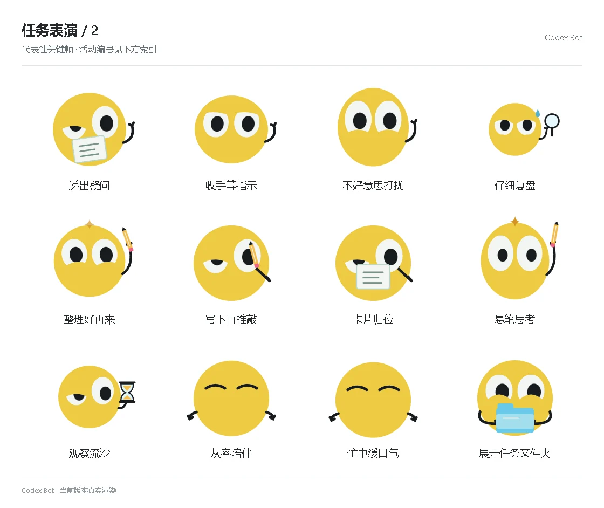

# 任务表演 / 2

[图鉴目录](README.md) · [项目首页](../../README.md) · [上一页](task-01.md) · [下一页](task-03.md)

| 活动 | 编号 | 基准时长 |
| --- | --- | ---: |
| 递出疑问 | `performance_help_offer` | 4.32 秒 |
| 收手等指示 | `performance_help_pause` | 4.32 秒 |
| 不好意思打扰 | `performance_help_shy` | 4.32 秒 |
| 仔细复盘 | `performance_help_review` | 4.32 秒 |
| 整理好再来 | `performance_help_retry` | 4.32 秒 |
| 写下再推敲 | `performance_work_write` | 4.32 秒 |
| 卡片归位 | `performance_work_sort` | 4.32 秒 |
| 悬笔思考 | `performance_work_think` | 4.32 秒 |
| 观察流沙 | `performance_work_wait` | 4.32 秒 |
| 从容陪伴 | `performance_work_breathe` | 4.32 秒 |
| 忙中缓口气 | `performance_work_reset` | 4.32 秒 |
| 展开任务文件夹 | `performance_start_folder` | 5.05 秒 |

[图鉴目录](README.md) · [项目首页](../../README.md) · [上一页](task-01.md) · [下一页](task-03.md)
