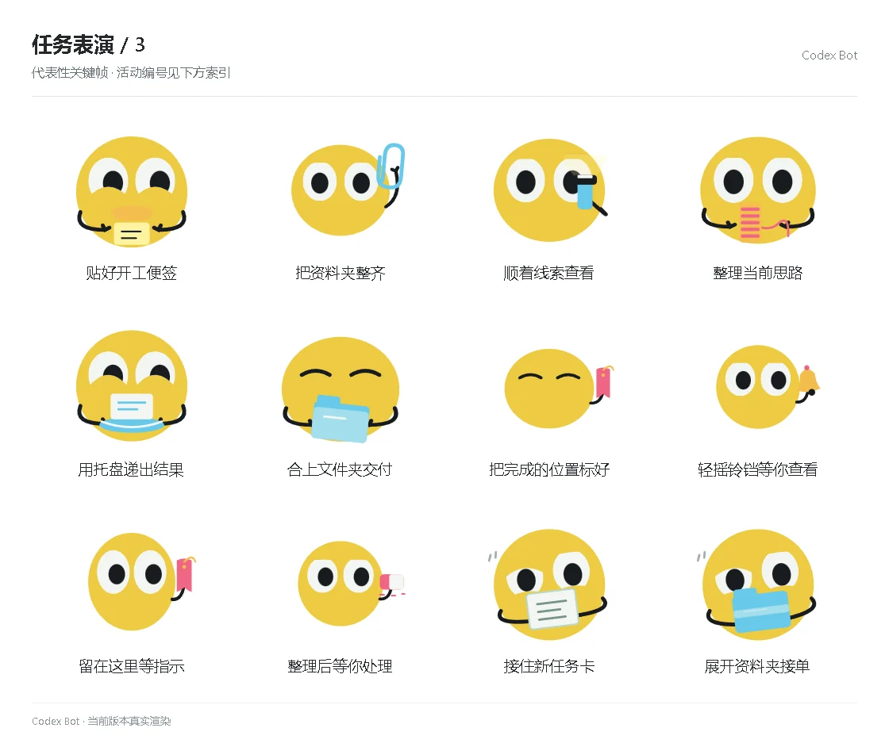

# 任务表演 / 3

[图鉴目录](README.md) · [项目首页](../../README.md) · [上一页](task-02.md) · [下一页](task-04.md)

| 活动 | 编号 | 基准时长 |
| --- | --- | ---: |
| 贴好开工便签 | `performance_start_note` | 5.05 秒 |
| 把资料夹整齐 | `performance_work_clip` | 5.05 秒 |
| 顺着线索查看 | `performance_work_light` | 5.05 秒 |
| 整理当前思路 | `performance_work_spool` | 5.05 秒 |
| 用托盘递出结果 | `performance_done_tray` | 5.05 秒 |
| 合上文件夹交付 | `performance_done_folder` | 5.05 秒 |
| 把完成的位置标好 | `performance_done_bookmark` | 5.05 秒 |
| 轻摇铃铛等你查看 | `performance_done_bell` | 5.05 秒 |
| 留在这里等指示 | `performance_help_bookmark` | 5.05 秒 |
| 整理后等你处理 | `performance_help_eraser` | 5.05 秒 |
| 接住新任务卡 | `performance_activity_catch_card` | 5.95 秒 |
| 展开资料夹接单 | `performance_activity_spread_folder` | 5.95 秒 |

[图鉴目录](README.md) · [项目首页](../../README.md) · [上一页](task-02.md) · [下一页](task-04.md)
