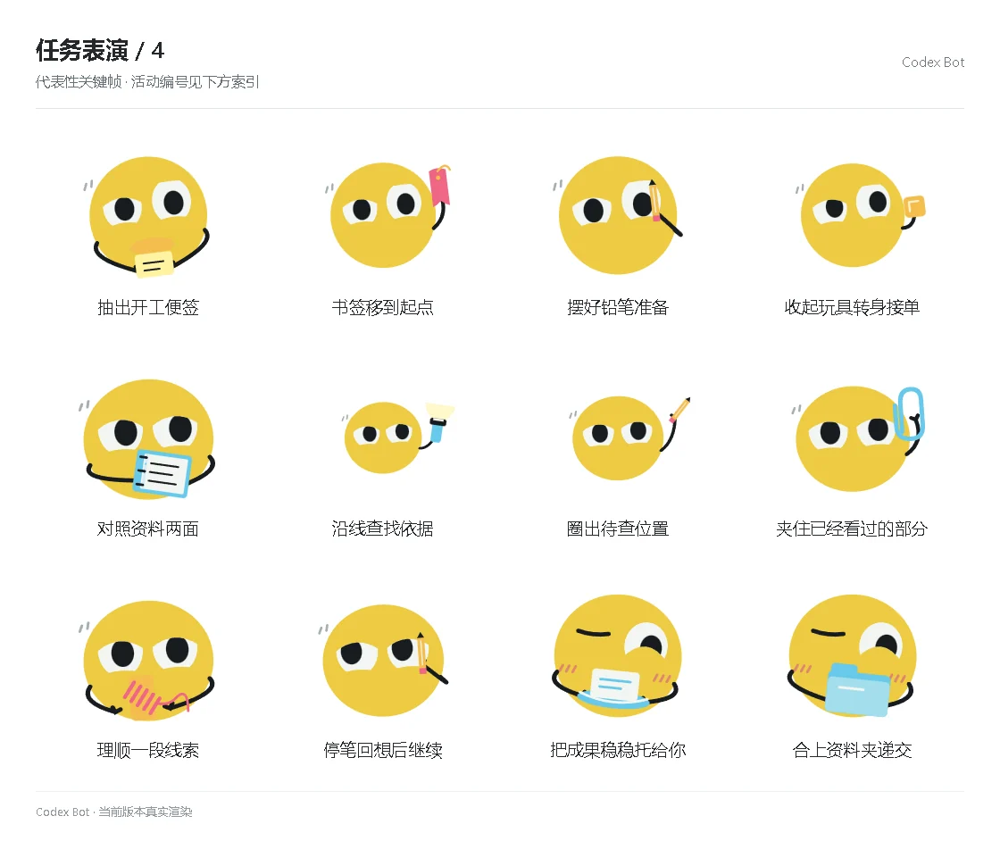

# 任务表演 / 4

[图鉴目录](README.md) · [项目首页](../../README.md) · [上一页](task-03.md) · [下一页](task-05.md)

| 活动 | 编号 | 基准时长 |
| --- | --- | ---: |
| 抽出开工便签 | `performance_activity_start_sticky` | 5.95 秒 |
| 书签移到起点 | `performance_activity_bookmark_begin` | 5.95 秒 |
| 摆好铅笔准备 | `performance_activity_pencil_ready` | 5.95 秒 |
| 收起玩具转身接单 | `performance_activity_toy_to_work` | 5.95 秒 |
| 对照资料两面 | `performance_activity_compare_pages` | 5.95 秒 |
| 沿线查找依据 | `performance_activity_trace_evidence` | 5.95 秒 |
| 圈出待查位置 | `performance_activity_mark_question` | 5.95 秒 |
| 夹住已经看过的部分 | `performance_activity_clip_read` | 5.95 秒 |
| 理顺一段线索 | `performance_activity_unwind_clue` | 5.95 秒 |
| 停笔回想后继续 | `performance_activity_recall_continue` | 5.95 秒 |
| 把成果稳稳托给你 | `performance_activity_tray_deliver` | 5.95 秒 |
| 合上资料夹递交 | `performance_activity_folder_deliver` | 5.95 秒 |

[图鉴目录](README.md) · [项目首页](../../README.md) · [上一页](task-03.md) · [下一页](task-05.md)
