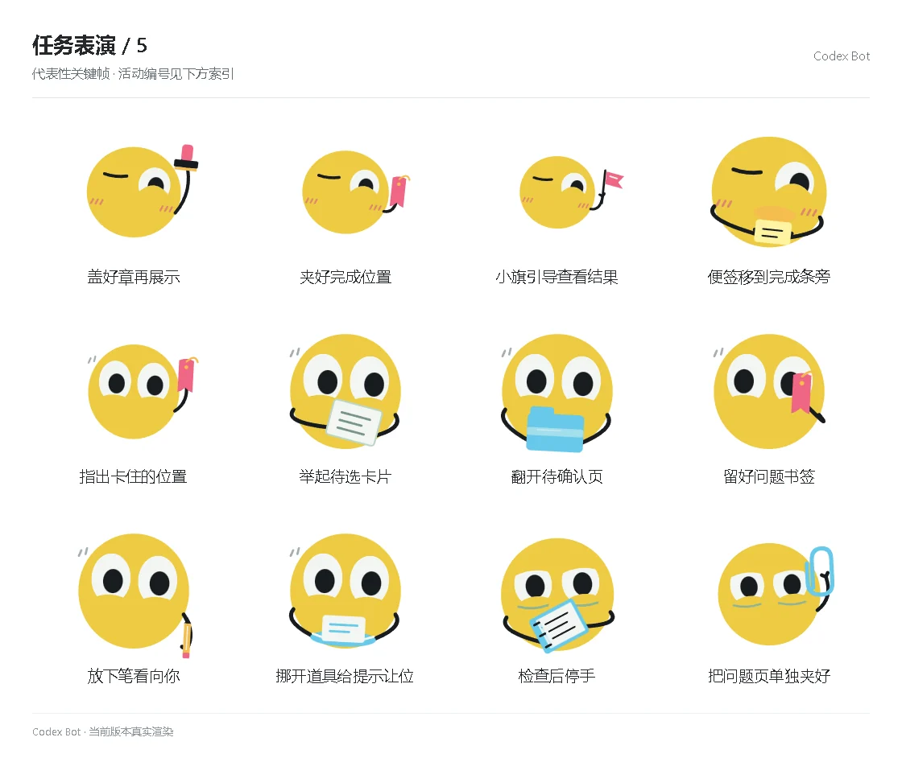

# 任务表演 / 5

[图鉴目录](README.md) · [项目首页](../../README.md) · [上一页](task-04.md) · [下一页](task-06.md)

| 活动 | 编号 | 基准时长 |
| --- | --- | ---: |
| 盖好章再展示 | `performance_activity_stamp_deliver` | 5.95 秒 |
| 夹好完成位置 | `performance_activity_bookmark_done` | 5.95 秒 |
| 小旗引导查看结果 | `performance_activity_flag_view` | 5.95 秒 |
| 便签移到完成条旁 | `performance_activity_sticky_done` | 5.95 秒 |
| 指出卡住的位置 | `performance_activity_blocked_place` | 5.95 秒 |
| 举起待选卡片 | `performance_activity_choice_card` | 5.95 秒 |
| 翻开待确认页 | `performance_activity_pending_page` | 5.95 秒 |
| 留好问题书签 | `performance_activity_question_mark` | 5.95 秒 |
| 放下笔看向你 | `performance_activity_put_pen` | 5.95 秒 |
| 挪开道具给提示让位 | `performance_activity_make_room` | 5.95 秒 |
| 检查后停手 | `performance_activity_check_stop` | 5.95 秒 |
| 把问题页单独夹好 | `performance_activity_error_page` | 5.95 秒 |

[图鉴目录](README.md) · [项目首页](../../README.md) · [上一页](task-04.md) · [下一页](task-06.md)
