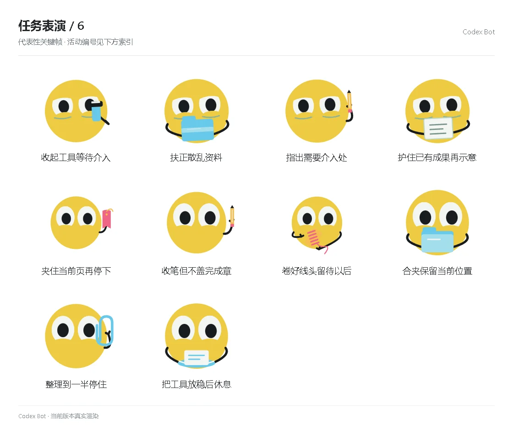

# 任务表演 / 6

[图鉴目录](README.md) · [项目首页](../../README.md) · [上一页](task-05.md)

| 活动 | 编号 | 基准时长 |
| --- | --- | ---: |
| 收起工具等待介入 | `performance_activity_tools_wait` | 5.95 秒 |
| 扶正散乱资料 | `performance_activity_tidy_failure` | 5.95 秒 |
| 指出需要介入处 | `performance_activity_help_place` | 5.95 秒 |
| 护住已有成果再示意 | `performance_activity_protect_work` | 5.95 秒 |
| 夹住当前页再停下 | `performance_activity_keep_page` | 5.95 秒 |
| 收笔但不盖完成章 | `performance_activity_put_pencil` | 5.95 秒 |
| 卷好线头留待以后 | `performance_activity_keep_thread` | 5.95 秒 |
| 合夹保留当前位置 | `performance_activity_keep_folder` | 5.95 秒 |
| 整理到一半停住 | `performance_activity_stop_sort` | 5.95 秒 |
| 把工具放稳后休息 | `performance_activity_tools_rest` | 5.95 秒 |

[图鉴目录](README.md) · [项目首页](../../README.md) · [上一页](task-05.md)
